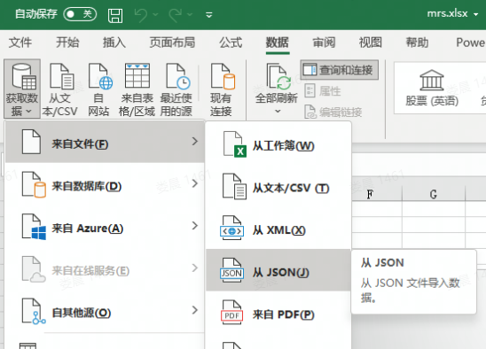

# [10 倍程序员系列] ⭐脚本的魅力，内含 js 写爬虫、python 骚操作等实用代码

## 零、内容简介

将脚本用好能给工作带来事半功倍的效果，本文的内容主要涉及三个脚本工具：`js`、`awk`、`python`， 主题如下：

- 使用 `js` 在浏览器控制台写爬虫。
- 使用 `shell` 统计数据。
- 使用 `python` 进行 `redis`、`rabbitmq` 运维。
- 使用 `python` 生成 `mysql 数据字典`。

话不多说，直接进入主题。

## 一、使用 js 在浏览器控制台写爬虫

### 1.1 抓取数据

使用 js 在浏览器控制台写爬虫的优势是不需要模拟浏览器请求、登录信息、基本不会被反爬虫技术禁止访问等，劣势是数据不易保存，如果爬虫是一次性的，且抓取的数据不多，使用 js 可以在几分钟就写好爬虫，至于获取的数据可以采取复制为 json 的方式导出，json 数据可以再进一步转换为易于阅读的 excel 等数据，读完这个章节你将掌握如何把复杂 json 转换为 excel 平面数据。

下面以获取某网站 gitlab 合并请求数据为例讲解整个数据抓取流程。

需求是获取所有 gitlab 项目的合并请求数据，项目 id 列表事先已经知道，代码如下：

```js
var ids = [1, 2, 3]; // 项目id

var mrs = []; // 数据结果

function mr(idx) {
  if (idx < ids.length) {
    fetch(
      "https://xxx.com/gitlab/projects/" +
        ids[idx] +
        "/getMergeRequests?order_by=updated_at&page=1&per_page=100&state=all",
      { credentials: "same-origin" }
    )
      .then((res) => res.json())
      .then((r) => {
        if (r.status === "success") {
          mrs.push(...r.result.merge_requests);
        } else {
          console.log(ids[idx] + " failed");
        }
        mr(idx + 1); // 为了让请求串行执行，所以这里采用回调递归调用
      });
  } else {
    console.log("done");
  }
}

mr(0); // 开始抓取
```

短短几行代码就完成了数据的抓取，整个编码过程只需要 `5` 分钟左右。

抓取之后，数据都存储在 mrs 变量中，直接在控制台输入 `mrs` ，右键选择拷贝 json 数据，新建一个 `mrs.json` 文件将其保存起来即可。

### 1.2 转换数据

接下来将 json 数据转换为 excel。

方案 1，使用 `pandas`：

```py
import pandas
pandas.read_json("mrs.json").to_excel("mrs.xlsx")
```

如果数据结构是下面这类简单 json 使用这两行脚本即可。

```json
[
  {
    "title": "标题",
    "content": "内容"
  }
]
```

若数据结构较复杂，列表对象中含有子对象，例如：

```json
[
  {
    "title": "标题",
    "content": "内容",
    "detail": {
      "createBy": "张三"
    }
  }
]
```

此时需要编码展开子对象，我们这里使用方案 2。

方案 2，使用 excel 导入 + `Power Query M 公式语言`转换数据。

1. 首先导入 JSON 数据。

   

2. 在 Power Query 的高级编辑器中，修改 `Power Query M 公式语言` 脚本展开 json 数据。

```cs
let responseJson = Json.Document(File.Contents("D:\mrs.json")),
headers =
 let
 allHeaders = List.Combine(List.Transform(responseJson, Record.FieldNames)),
 uniqueHeaders = List.Distinct(allHeaders)
 in
 uniqueHeaders,
 testTable = Table.FromRecords(responseJson, headers, MissingField.UseNull)
 in
 testTable
```

这样就完成了数据的转换，后续再生成数据图表或导入数据库都非常方便。

这部分内容的重点在于要灵活使用各种工具以快速得到想要的结果。

## 二、使用 shell 统计数据

需求：在上百个 Java 代码仓库中统计单元测试方法的数量。

我们以这个例子来看看 `awk` 的用法。

说明：这个统计方法只是简单查看单元测试方法数量，不涉及单元测试覆盖率等。

步骤如下：

1. 首先本地含有所有的代码仓库，cd 到代码仓库根目录。

2. 使用以下命令统计每个仓库的单元测试方法数量。

```bash
find . -name '*Test.java' | xargs grep -i '@Test[^a-z]' | awk -F / '{count[$3]++;} END {for(i in count) {print i,count[i]}}' | clip.exe
```

注意：该命令运行在 `WSL`，所以可以在管道命令中包含 windows 命令。

命令说明：

```bash
find . -name '*Test.java' | xargs grep -i '@Test[^a-z]'
```

找到所有 Test.java 结尾的文件，在文件中查找仅包含 @Test 的行，这一步的输出结果如下：

```txt
./project/repository1/module/src/.../xxx.java: @Test
./project/repository2/module/src/.../xxx.java: @Test
./project/repository3/module/src/.../xxx.java: @Test
...
```

根据这个数据模式，再使用 awk 编写脚本进行数据分析。

```bash
awk -F / '{count[$3]++;} END {for(i in count) {print i,count[i]}}'
```

awk 脚本中指定 / 为分隔符，第三位为仓库名称，使用仓库名称进行分组，最后输出仓库名称和分组数量。

输出结果：

```txt
repository1 5
repository2 10
repository3 7
...
```

最后我们利用管道 `| clip.exe` 将其拷贝到剪切板，再导入 excel 即可。

## 三、使用 python 进行 redis、rabbitmq 运维

### 3.1 扫描 redis

当 redis 内存过期速度赶不上内存增长，会导致 redis 内存占用越来越大，我们可以调整 redis 清理频率，也可以手动扫描 redis 来触发内存清理。

使用 python 执行以下代码即可，真是 `人生苦短，我用 python`。

```py
import redis
r = redis.Redis()
t = r.scan()
while t[0]:
    t = r.scan(t[0])
```

### 3.2 rabbitmq 消息队列转发

rabbitmq 上有消息队列转发的插件，但如果是云服务，通常无法使用该插件，此时用 python 写点转发脚本也是易事。

```py
import pika

connection = pika.BlockingConnection(pika.ConnectionParameters(host='ip', port=5672, virtual_host='/', credentials=pika.PlainCredentials('account','password')))

channel = connection.channel()

def backcall(ch, method, properties, body):
    # 转发
    channel.basic_publish(exchange='exchange', routing_key='routing_key', body=body)

channel.basic_consume('原队列',backcall, True)

channel.start_consuming()
connection.close()
```

## 四、使用 python 生成 mysql 数据字典

生成数据字典的工具有很多，但往往生成的数据字典不易修改，试试用 python 生成 markdown 格式的数据字典如何？

```py
import mysql.connector
import importlib
import sys


def generate(database_name):
    """
    生成数据库字典表
    """
    importlib.reload(sys)

    # 使用前修改配置
    conn = mysql.connector.connect(
        host='localhost',
        port='3306',
        user='',
        password='',
        use_pure=True
    )

    cursor = conn.cursor()

    cursor.execute(
        "SELECT TABLE_NAME, TABLE_COMMENT FROM information_schema.TABLES WHERE table_type='BASE TABLE' AND TABLE_SCHEMA='%s'" % database_name
    )

    tables = cursor.fetchall()

    markdown_table_header = """\n\n\n### %s (%s) \n| 序号 | 字段名称 | 数据类型 | 是否为空 | 字段说明 |\n| :--: |----| ---- | ---- | ---- |\n"""
    markdown_table_row = """| %s | %s | %s | %s | %s |"""

    f = open('dict/'+database_name + '.md', 'w', encoding="utf-8")

    for table in tables:

        cursor.execute(
            "SELECT ORDINAL_POSITION, COLUMN_NAME, COLUMN_TYPE, IS_NULLABLE, COLUMN_COMMENT "
            "FROM information_schema.COLUMNS WHERE TABLE_SCHEMA='%s' AND TABLE_NAME='%s'" % (
                database_name, table[0]
            )
        )

        tmp_table = cursor.fetchall()
        p = markdown_table_header % (table[0], remove_newline(table[1]))
        for col in tmp_table:
            colf = list(col)
            colf[2]=col[2].decode() # mysql 高级版本需要解码，代码有点丑，临时性的，能用就行
            colf[4]=col[4].decode()
            p += (remove_newline(markdown_table_row % tuple(colf)) + "\n")
        print(p)
        f.writelines(p)

    f.close()
    cursor.close()
    conn.close()


def remove_newline(text):
    """
    去除文本中的换行符号
    """
    return text.replace("\r", "").replace("\n", "")


if __name__ == '__main__':
    conn = mysql.connector.connect(
        host='localhost',
        port='3306',
        user='',
        password='',
        use_pure=True
    )

    cursor = conn.cursor()

    cursor.execute("SHOW DATABASES");

    dbs = cursor.fetchall()

    for db in dbs:
        generate(db[0])

    cursor.close()
    conn.close()
```

## 五、后记

本篇文章内容比较杂，这些脚本不能说非常优美，但写起来确实是非常的高效，能够快速地完成需求，当我们把这些工具掌握的同时，偶尔发挥下想象力，必然能够体会到编程的乐趣和代码的魅力。
