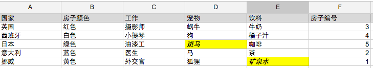

# 使用prolog解决爱因斯坦斑马难题

目前商业上广泛使用的编程语言多是命令式或函数式的编程语言，这些语言在某些方面具有很高的相似度，比如 python 和 ruby 在很多地方是相通的，学会了一门，再学另一门便能够事半功倍，很多语言都是如此，然而今天要介绍的这门语言，却跟主流编程语言截然不同，它就是prolog——一门逻辑编程语言。

prolog 是 Programming in Logic 的缩写，它被广泛应用在人工智能、自然语言等研究领域，使用它来解决逻辑难题完全不在话下，今天我们将使用它来解决著名的爱因斯坦逻辑难题（斑马难题），首先让我们来认识一下 prolog 的语法。

## prolog 基本语法

prolog 中有3种基本元素：事实、规则和查询。事实和规则用于描述数据，查询用于获取问题的答案。

我们可以这样定义事实：


``` prolog
human(lucy).
human(lili).
father(lucy,david).
sister(lucy,lili).
sister(lili,lucy).
```

这段代码表示 lucy 和 lili 是人类，且她们是姐妹，david 是 lucy 的父亲，继续定义规则：

``` prolog
daughter(Father,A,B) :-
    father(A,Father), sister(A,B)
```

这段规则表示对于变量A、B，如果Father变量是A的父亲，且A、B是姐妹，则A、B是Father对象的女儿。

注意，在 prolog 中一个词若以小写开头，那么它是一个固定值，若以大写字母开头，则是一个变量。

将这些事实和规则放在一个文件里面，在命令行下打开 prolog ，对这个文件进行编译，即可提出查询，比如 daughter(david,A,_)，prolog 将会求出A可能的取值并输出到控制台，最后的下划线是一个占位符，不会进行求值。

在 prolog 中还可以使用递归完成列表和数学等运算，这部分是很强大的，但这里不打算讲，因为有了上面的基础知识后，我们就可以利用它来解决逻辑问题了，下面就让我们来解决“斑马难题”吧。

## 爱因斯坦逻辑难题

> 5个不同国家且工作各不相同的人分别住在一条街上的5所房子里，每所房子的颜色不同，每个人都有自己养的不同宠物，喜欢喝不同的饮料。根据以下提示，你能告诉我哪所房子里的人养斑马，哪所房子里的人喜欢喝矿泉水吗？

1. 英国人住在红色的房子里
1. 西班牙人养了一条狗
1. 日本人是一个油漆工
1. 意大利人喜欢喝茶
1. 挪威人住在左边的第一个房子里
1. 绿房子在白房子的右边
1. 摄影师养了一只蜗牛
1. 外交官住在黄房子里
1. 中间那个房子的人喜欢喝牛奶
1. 喜欢喝咖啡的人住在绿房子里
1. 挪威人住在蓝色的房子旁边
1. 小提琴家喜欢喝橘子汁
1. 养狐狸的人所住的房子与医生的房子相邻
1. 养马的人所住的房子与外交官的房子相邻

这道题的解题关键在于，要以一种清晰的方式将每个房子相关的属性（国家、颜色、工作、宠物、饮料、编号）列出来，前面5个提示中包含了5个国家，那么可以利用这一点画出一个表格，每一行表示一个国家，每一列表示房子的一种属性。一步步根据提示得到一些推论，将结果填入表格，答案便渐渐清晰起来，使用这种人工方式推理的结果如下图所示： 



虽然我们知道了解题的关键，但这个问题仍然需要经过很多步的推导才能得出结果，如果使用 prolog 那得到这个问题的答案就简单多了，只需要定义好事实和规则，然后向 prolog 提出问题，逻辑引擎就会为我们查出结果来。

下面是解决这个问题的 prolog 代码。

``` prolog
house(A,[A,_,_,_,_]).
house(A,[_,A,_,_,_]).
house(A,[_,_,A,_,_]).
house(A,[_,_,_,A,_]).
house(A,[_,_,_,_,A]).

right(A,B,[A,B,_,_,_]).
right(A,B,[_,A,B,_,_]).
right(A,B,[_,_,A,B,_]).
right(A,B,[_,_,_,A,B]).

middle(A,[_,_,A,_,_]).

first(A,[A,_,_,_,_]).

neighbor(A,B,[A,B,_,_,_]).
neighbor(A,B,[_,A,B,_,_]).
neighbor(A,B,[_,_,A,B,_]).
neighbor(A,B,[_,_,_,A,B]).
neighbor(A,B,[B,A,_,_,_]).
neighbor(A,B,[_,B,A,_,_]).
neighbor(A,B,[_,_,B,A,_]).
neighbor(A,B,[_,_,_,B,A]).

attr(Country,Pet,Color,Drink,Work).

all_houses(Houses) :-
    house(attr(britsh,_,red,_,_), Houses),
    house(attr(spain,dog,_,_,_), Houses),
    house(attr(japan,_,_,_,painter), Houses),
    house(attr(italy,_,_,tea,_), Houses),
    house(attr(norway,_,_,_,_), Houses),
    first(attr(norway,_,_,_,_), Houses),
    right(attr(_,_,white,_,_), attr(_,_,green,_,_), Houses),
    house(attr(_,snail,_,_,photographer), Houses),
    house(attr(_,_,yellow,_,diplomat), Houses),
    middle(attr(_,_,_,milk,_), Houses),
    house(attr(_,_,green,cafe,_), Houses),
    neighbor(attr(norway,_,_,_,_), attr(_,_,blue,_,_), Houses),
    house(attr(_,_,_,orange,violinst), Houses),
    neighbor(attr(_,fox,_,_,_), attr(_,_,_,_,doctor), Houses),
    neighbor(attr(_,horse,_,_,_), attr(_,_,_,_,diplomat), Houses),

    house(attr(_,zebra,_,_,_), Houses),
    house(attr(_,_,_,water,_), Houses).
```

在事实部分，将房子看做一个整体，描述了房子在5所房子中、房子的左右关系、中间的房子处于什么位置、第一所房子处于什么位置、房子间的相邻关系以及每所房子拥有哪些属性。

规则部分包含了对题目中提示的描述和最终问题的描述，这些定义是为了告诉逻辑引擎，在求值时必须满足这些条件。
最终的查询为 all_houses(A) ，prolog 逻辑引擎将会查找出满足结果的房子数组，注意每所房子由它的属性组成，这样最后得到的结果为：

``` prolog
[attr(norway, fox, yellow, water, diplomat),  
attr(italy, horse, blue, tea, doctor),  
attr(britsh, snail, red, milk, photographer),  
attr(spain, dog, white, orange, violinst),  
attr(japan, zebra, green, cafe, painter)]
```
