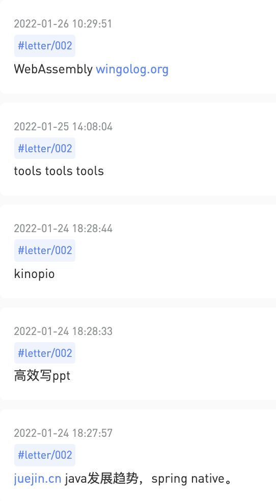

# 002 🕷 Web 3.0、关于好品味的商业模式

欢迎打开第 002 期 tech letter，这是由 lcomplete 每周发送的 newsletter，它分享简短实用的效率方法、技术文章、实用工具等，文章主要有三块内容：摘要分享、我的一周（对大家能有所帮助或启发的内容）和本周引用（经典名句），感谢你的阅读！

## **本期摘要**

原本用 flomo 记录了本周准备写的东西，但在写的时候却改变了想法，下面这些可能要留到后面几期了。

 这一期我们来聊聊 Web 3.0 和信息大爆炸背景下关于内容推荐的商业模式。

- 我眼中的 Web 3.0
- 内容推荐者是新的内容创造者，具有好的品味是能赚钱的？

## 我眼中的 Web 3.0

Web 1.0 是网站主单方面输出信息，Web 2.0 是由用户介入到信息创造，相当于是电商领域由 B2C 到 C2C 的转变，那什么是 Web 3.0 ？关于这点，有些众说纷纭了，有人说它跟人工智能有关，有人跟说它跟区块链有关，也有人说它跟 2.0 一样是一个很好的营销手法，虽然说现在没有一个准确的定义，但是我相信它跟 2.0 一样，迟早会形成一种质变，最后使得人们逐渐习惯它。

关于这些争论中，我最喜欢的一个 Web 3.0 的含义是 `将互联网转化为数据库`。

在 Airtable 中我们已经看到了将表格转换为数据库的威力，在 Notion 中我们看到了将文档转换为数据库的能力，如果将整个互联网转化为数据库，那是何等的壮观。

我们以前听到过互联网就是一个超大的数据库的比喻，但是互联网上的数据不是标准化的，也没有一套使用标准，信息的检索、使用、互联都是受限的，如果这些限制被打破呢？其实许多限制已经被打破，开放 API 和开放数据格式几乎是所有互联网独角兽产品的标准配置，我们可以轻松地连接两个产品，让它们的数据互通，这是 Web 3.0 的一部分，它还在发展中，我相信未来会发明出更多的标准协议让这些互联互通更加普遍。

[Web3 - 维基百科，自由的百科全书](https://zh.wikipedia.org/wiki/Web3)

## 内容推荐者是新的内容创造者，具有好的品味是能赚钱的？

不用等到 Web 3.0 时代，我们早已处在一个信息大爆炸的时代，在 Web 3.0 时代爆炸会加速吗？刚才提及的将互联网转化为数据库，其实是对这部分的一个铺垫。

数据库对于我们后端开发来说再熟悉不过了，如何优化数据库的查询性能，第一个想到的大概率会是加索引，如果互联网本身是个超大型的分布式数据库，那给它建索引的价值是非常巨大的，这方面最成功的自然是 Google 了，那对于个人或者小团体来说，能不能维护一份内容索引来赚钱呢？答案是肯定的，这种商业模式也是被经过验证的，比如说少数派、各类做知识付费加广告赞助的「技术大牛」，其实他们的很多文章都是内容推荐类的，国外一般称这群人为 `Curators(图书馆馆长、内容推荐者)` ，也就是说全世界都有通过内容推荐来赚钱的人。

通过内容推荐来赚钱是一个不错的商业模式，但也是有前提的：

**首先，必须足够深入并精通某一领域。**

作为个人来说，精力有限，能精通一两个领域已经非常厉害，所以个人做内容推荐基本上是在某一垂直领域，作为程序员，我们接触的这类推荐者非常多，因为程序员已经发展为一个非常庞大的群体。

掘金上充斥着许多 GitHub 项目推荐、IDE 插件推荐类的文章，这类文章也比较容易成为热门，我自己也写过一篇，只花了一点点写作的时间，却获得了不错的阅读量，其实在我自己看来这是一篇水文。

[[10 倍程序员系列] ⭐51W+ 的终端命令行工具助你成为 10 倍程序员 - 掘金](https://juejin.cn/post/6966606708848197645)

说它是一篇「水文」，只是由于我写作这篇文章的难度低，那些工具都是我平常使用或收集的，我只需要罗列并做一个简单的介绍就可以了， 但是对于那些喜欢使用命令行的人来说却很可能具有价值。一篇文章写作的难度跟它的价值并非成比例关系，如果作者熟悉某一领域，内容推荐的质量也较高。

**其次，必须有足够好的「品味」。**

掘金上的内容推荐类的文章一开始我是比较反感，因为上面推荐的大多数东西要么我已经知道了，要么就是价值不大的，要做好内容索引我们也需要有一个好的「品味」，并且持续不断地发现和过滤出真正有价值的信息。这样才大抵算的上是内容创造。

想通了这些后，我不再反感掘金上内容推荐类的文章，只是那些不太符合我的「口味」罢了。

这一小节所使用标题的原文：

[Curators Are the New Creators](https://gabygoldberg.medium.com/curators-are-the-new-creators-the-business-model-of-good-taste-5852727d4b54)

## 我的一周

- 完成了《架构组2021年度工作汇报》
    
    我的 ppt 被评价为是比较专业的，但实际上在 ppt 的外观上我并没有花什么时间，这其中用到以下几个工具帮助我快速制作 ppt。
    
    - PPT 设计灵感，用于自动设计。
    - Kinopio，绘制规划。
    - ScreenToGif，用于录制 Gif 进行展示。
    - Awesome Screenshot 插件，截取浏览器使用视频用于展示。
    - Excel 数据分析图，制作图表。
    
    列完后发现似乎没有必要单独再写一期如何高效制作 PPT 了。
    

## 本周引用

> The future is already here — it’s just not very evenly distributed.  
译：未来已来，只是还没有平均分布。

—— [William Gibson]
> 

（完）