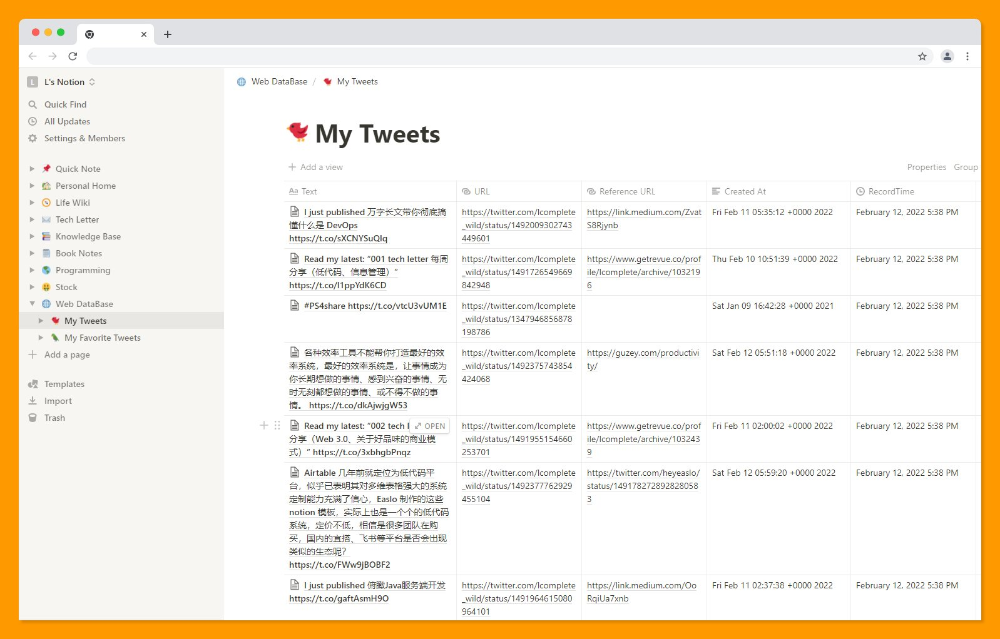
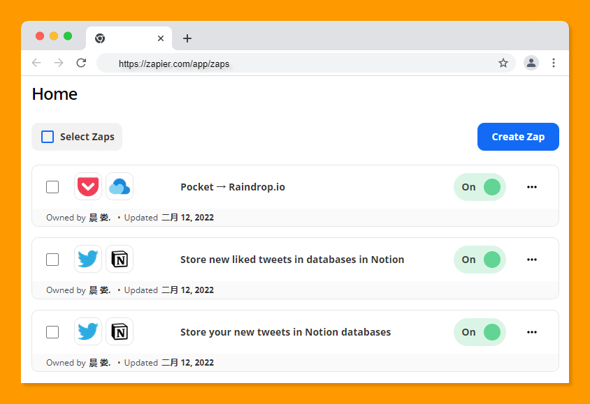

# 005 ⚙️ IFTTT 和 Zapier 使用对比、最好的效率系统、投入产出比最高的 3 件事

欢迎打开第 005 期[「野生架构师」周刊](https://www.getrevue.co/profile/lcomplete)，这是由 [lcomplete](https://github.com/lcomplete) 每周发送的 newsletter，它分享简短实用的效率方法、优质文章、编程知识、实用工具等，感谢你的阅读！

## IFTTT 和 Zapier 使用对比

先介绍一下什么是 IFTTT，这是一个老牌的自动化工作流平台，可以集成不同的应用程序，当 A 应用程序触发某事件时，可将信息传送给 B 程序进行处理，IFTTT 得名为其口号「if this then that」。

Zapier 又是什么呢？可以简单地理解为增强的 IFTTT，它比后者的功能更加强大。

那么本次带来两者的使用对比，当然 Zapier 完胜。
首先 Zapier 在执行效率上远超 IFTTT，来看这个简单的场景，将加入 `Pocket` 的书签自动同步到 `Raindrop`，使用 IFTTT 时平台执行一次需间隔 1 小时，而使用 Zapier 时 2 分钟左右就完成了同步。

[To Read / lcomplete](https://raindrop.io/lcomplete/to-read-23073692)，从我的 pocket 中自动同步到这里的共享书签，可从中发现优质文章。

Zapier 还提供数据传输等功能，尝试将我的推特一次性导入至 `notion` 数据库，使用便捷。

另外设置了两个工作流：将我发布和喜欢的推特保存至 notion，形成我的 `Web Database`，这样做的好处是显而易见的，比如写作这篇 newsletter 时只需要打开 notion 查找资料即可。

另外对于免费用户而言，Zapier 也没有 IFTTT 的 5 个工作流的限制，取而代之的是每月 1000 个任务执行次数的限制。

如果超出了免费的使用限制，Zapier 的每月费用较高，这时也可以使用开源的 `n8n` 来搭建自动化工作流系统，将其部署在自己的服务器上，费用会更低，不过使用体验上会逊于 Zapier，对于不懂编程的普通用户也不易部署和上手使用。

关于 n8n 的使用方法，可以查看我之前写的这篇文章。

[使用开源工作流自动化工具 n8n 打造个人助理 - 掘金](https://juejin.cn/post/6964671068678127652)

关于 IFTTT 和 Zapier 的使用对比，我也率先分享在了 twitter 上，如果你想及时地获取我分享的一些有趣好玩的东西，可以关注我的 twitter。

[lcomplete (@lcomplete_wild) | Twitter](https://twitter.com/lcomplete_wild)

## 最好的效率系统

各种效率工具不能帮你打造最好的效率系统，最好的效率系统是，**让事情成为你长期想做的事情、感到兴奋的事情、无时无刻都想做的事情、或不得不做的事情**。

> “Every productivity system stops working eventually and there’s nothing you can do about it… Most productivity tricks develop aversion around them. All of them lose salience. The only way to avoid encountering problems with productivity is to make the stuff you want to be doing in the long-term to be the most exciting stuff you can do at any moment in time, which is perhaps possible if you, e.g. work at a startup, but is untenable in almost every situation” – [Alexey Guzey](https://guzey.com/productivity/)

其实这背后隐含着我们熟悉的一句话，叫做 `deadline` 是最高生产力，当我们把事情转化成自己有激情去做，甚至不得不去做的事情的时候，这是对抗拖延症最有效的方法，是任何效率工具都无法比拟的。

### 那么如何把事情变成长期想做的、有激情的事情呢？

可以试着把事情的边界扩大，举个例子，比如看一本书，如果边界只是看完它，那很难让你有特别强烈的激情，如果把边界扩大为看完这本书后继续阅读写作，成为一个有知识的人，再从跟他人的交流分享中获得满足感，再进一步产生影响力，让更多的人受到你的良性影响，甚至让这个世界变的更美好一些。这个格局和边界瞬间就不一样了，我们对待这件事情的激情也能提升，使得看书这件事情成为我们当下想做的事情。

## 投入产出比最高的 3 件事

这个部分受到 Aadit Sheth 的 twitter 的启发。从中挑选了几个我认为 ROI 非常高的事情。

[Aadit Sheth on Twitter: "10 things that I've seen have the highest ROI:"](https://twitter.com/aaditsh/status/1490374744667041793)

### 1、将两个人联系在一起

将两个志同道合的人联系在一起，如果他们真的合适（在商业、友谊或爱情方面），他们会永远的记住你。

### 2、在互联网上写东西（当众学习）

Aadit Sheth 说，将你的想法发布在网上有利于找到志同道合的朋友。但我认为更重要的是，当众学习是很好的一个学习方法。

> 当众学习（`Learn In Public`）就像是费曼学习法的加强版，能在公共场合传授我们所学，这是更高的标准。

上面这段话来自下面这篇文章，作者是微软的一位工程师。

[深刻启发我的 3 篇文章 | 程序员的喵](https://catcoding.me/2022/01/10/share-3-articles.html)

### 3、立即行动

有想法或灵感时要立即行动，随着时间的推移，灵感会迅速减少。立即行动能够有效地对抗拖延症，并且能够对自身产生长远的激励。

005 这篇 newsletter，其实我在前几天晚上就想写了，由于一些事情而搁置了，一些写作灵感也迅速地消失不见，因为这件事也更深刻地体会到立即行动的重要，于是我的 newsletter 也不再限于一周发布 1 篇，有想法时立即行动！
