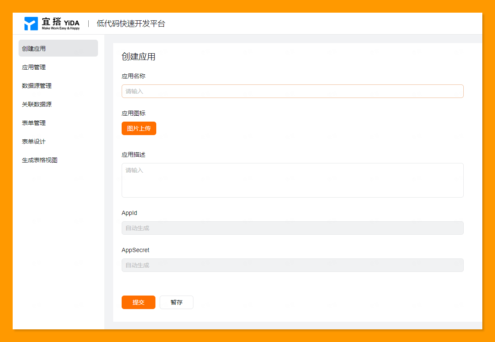
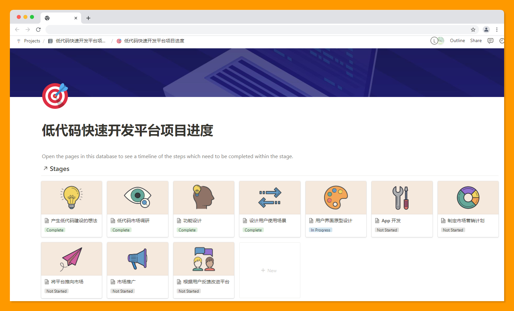

# 006 📒 与人保持联系的系统、用低代码应用设计产品原型、万能锤

欢迎打开第 006 期「野生架构师」周刊，这是由  [lcomplete](https://github.com/lcomplete/TechShare) 每周发送的 newsletter，它分享简短实用的效率方法、优质文章、编程知识、实用工具等，感谢你的阅读！

## 与人保持联系的系统

很多时候我们都在用各种效率工具去管理知识，但是有多少人想过管理联系人并和他们保持联系呢？

[The simple system I’m using to stay in touch with hundreds of people](https://jakobgreenfeld.com/stay-in-touch)

> Staying in touch with people is one of these asymmetric habits that require little effort, time and resources but has an unlimited upside.

与人保持联系是一个**回报远大于付出**的习惯之一，它只需要花很少的努力、时间和资源，但却有无限的好处。

这篇文章讲的是作者如何使用 [Airtable](https://airtable.com/) 管理联系人，并设置自动化任务来每天提醒他该与谁进行联系，值得一读。

我认为该文的重点并非是自动化部分，而是与人保持联系的习惯，想想我们有多少曾经亲密的好友已经许久不联系了，回想起来你是否觉得可惜呢？

文中提到一个与人联系的系统——将联系人分为 `A、B、C、D` 这 4 类。

- A 类联系人每 3 周联系一次；
- B 类每 2 个月联系一次；
- C 类每 6 个月联系一次；
- D 类每年联系一次。

可以按照自己的喜好去设置时间间隔，比如亲人每 2 周联系一次。对于不需要与上百人保持联系的普通人，并不需要使用 Airtable 这样复杂的自动化设置，也许一个简单的 To Do 重复提醒即可满足需求。

## 用低代码应用设计产品原型

在产品原型设计领域 Axure 无人能出其右，这也是产品经理的必备技能，但是对于非产品经理人士，有时候想快速设计原型来表达产品概念，用 Axure 学习成本较高。

这个时候可以有几个其他选项：

- 使用 [balsamiq.cloud](https://balsamiq.cloud/) 制作原型草图，它非常容易上手使用；
- 使用 Excel 设计原型，可以将它当作一个画板来使用；
- 使用低代码应用来进行快速原型设计，这样做有许多好处：可快速进行表单设计、最终原型是可操作的、花费极少的时间就能获得专业的原型效果。

## 万能锤

先从一个故事开始。

> 有个人去工具店买锤子。
>
> 店主说，No，我们已经不卖锤子了，锤子有很多种，大锤、拔钉锤、圆头锤等等，如果你买了一个之后又发现还需要另一个怎么办？多数人只想要一把锤子，所以我们推出了 `万能锤` ，可以当各种锤子使用。
>
> 买者想想也是，那就买一把万能锤吧。
>
> 店主说，No，万能锤已经被淘汰了，你想，万能锤虽然可以当各种锤子用，但它做什么活都没有专门用途的锤子好使，所以，我们开始卖`锤子制作器`，这样你可以随时制造最合适的锤子。
>
> 买者说，但我并不想买个制作器……
>
> 店主说，没错，所以它已经被淘汰了，我们研究发现，不是所有的用户都愿意自己制作锤子，所以我们推出了`锤子定制服务`，你只要提出锤子需求，我们就可以造出你想要的锤子。

这个故事可以衍生到许多场景，比如「笔记万能锤」、「管理万能锤」等等，这就像软件世界的一句名言一样——没有银弹。

### 笔记万能锤

有人问我记笔记用什么工具，我说，`Notion + WorkFlowy + Obsidian`等，他说这些工具不是冲突的吗？其实不然，Notion 被称作是笔记界的瑞士军刀，就像「`万能锤`」，但是它在记大纲笔记上比不上 WorkFlowy，在速度上更比不上本地使用的 Obsidian，充分利用不同工具的优势才能最大化提升生产力，一点点的工具学习成本是值得的。

Notion 在很多方面比不上其他应用，那为什么还要使用它呢，主要在于 Notion 不光是一个「万能锤」，其实它还是一个「`锤子制作器`」，它不仅是一个笔记工具，也是一套笔记系统，使用它可以灵活地制定笔记方式。

它能制作什么样的锤子呢，比如：

这是通过 [aNotioneer](https://www.notion.so/aNotioneer-be59e14d857a4d658db394a0441a3b88) 制作的模板而快速创建的，他提供模板则是一种「`锤子定制服务`」。

不是任何人都有能力使用「锤子制作器」来制作锤子，所以基于 Notion 的「锤子定制服务」其实已经形成了一个市场，一个 20 岁的小伙说它通过「定制锤子」在一个月的时间赚了 12000 美金（当然这不一定是真话）。

[Easlo (Jason Chin) on Twitter: "I made $12,000 online last month. I’m just 20, here’s how I did it:"](https://twitter.com/heyeaslo/status/1491782728928280583)

关于万能锤的故事对你有什么启发吗？

如果你觉得这是个不错的故事，不妨分享给你的朋友看看，同时与他们保持联系。

bye.
