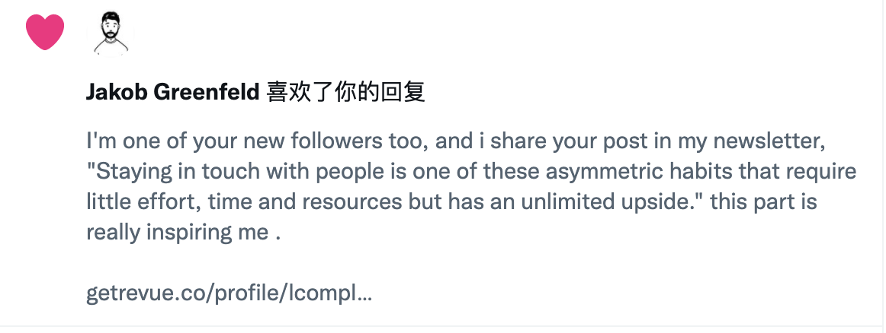

# 007 🍀 十年后重新使用 RSS 给我带来的巨变

欢迎打开第 007 期「野生架构师」周刊，这是由  [lcomplete](https://github.com/lcomplete/TechShare) 每周发送的 newsletter，它分享简短实用的效率方法、优质文章、编程知识、实用工具等，感谢你的阅读！

去年底，脑海里一直有个念头——重拾以前的优秀习惯，于是时隔十年再次打开 Feedly 这个 RSS 阅读器来寻找值得关注的信息源。

在这个过程中，有两件事对我影响较大：

- 开始写 newsletter 。
- 发现现阶段对我来说许多优质的信息都是英文的。

## 开始写 newsletter

去年底，我在写年终总结时，定了个计划，要持续给公司的工程师们分享优质的讯息，而之前这些分享都是零散和不成系统的，看到 happy xiao 的博客和 newsletter 后，我便决定也开始写 newsletter，这样不仅可以系统地分享，也可以跟更多的人建立联系。

写 newsletter 必然需要大量的阅读，于是近期我阅读了许多优秀的文章，这些海量的信息竟然奇妙地产生了联系。

## 重新学习英语所产生的奇妙体验

日常工作中，我的英语已经够用，但要阅读海量的英文文章，这显然就不够用了，于是我决定重新学习英语。

为了更好地阅读英文文章，我注册了 medium 平台，看到 bytefish 写的 [程序员如何通过在 Medium.com 上写技术博客赚钱？](https://medium.com/%E5%86%99%E4%BD%9C%E4%B9%8B%E8%B7%AF/%E7%A8%8B%E5%BA%8F%E5%91%98%E5%A6%82%E4%BD%95%E5%9C%A8medium-com%E4%B8%8A%E9%80%9A%E8%BF%87%E5%86%99%E6%8A%80%E6%9C%AF%E5%8D%9A%E5%AE%A2%E8%B5%9A%E9%92%B1-6d47d82b03dd)，接着我又看到阮一峰在 [194 期](http://www.ruanyifeng.com/blog/2022/02/weekly-issue-194.html) 周刊也推荐了这篇文章，即使我不主动注册 medium，也很有可能因为看了阮一峰的科技周刊而去使用它。

**因为这些信息是我主动捕食，而不是别人喂养的。**

最近一周我逛 v2ex 的时间不超过 10 分钟，但却偶然在一个讨论公众号的帖子里发现了 [程序员的喵](https://catcoding.me/) 的博客，这位微软的工程师写了许多优秀的文章，而且竟然也写到了程序员英语的重要性和在 medium 上写文章赚钱的事情，于是我订阅了他的博客。

就在昨天，我在 Feedly 上查看 Hacker News 的热点，看到 Jakob 博士的热文 [The simple system I’m using to stay in touch with hundreds of people](https://jakobgreenfeld.com/stay-in-touch)，文章对我启发很大，于是我立即行动写了第 [#006](006.md) 篇 newsletter，写完后我在 twitter 关注了 Jakob，并跟他有了下面的互动。

接着奇妙的事情发生了，晚上我去洗澡的时候打开了播客（依旧是重拾丢失已久的习惯），随手点开 happy xiao 的 [036 Nathan Latka 的彪悍人生，以及我们可以学到的 6 件事](https://happyxiao.com/yrgs036/) 这期播客，他讲的竟然是 Jakob 写的一篇文章 [6 Lessons I Learned from Nathan Latka](https://jakobgreenfeld.com/latka) 。

今天早上我看到 Jakob 的一条推文：

[Jakob Greenfeld on Twitter](https://twitter.com/jakobgreenfeld/status/1493978581361254402)

> “An important part of my strategy this year is to increase my luck surface area.
>
> Ideas I’m testing:
>
> • More podcast appearances, projects, and threads to a larger number of people aware of my existence.
>
> • Regular tweets and podcasts to make sure my name stays top of mind.”

这篇推文讲的是他今年的战略是要持续扩大`运气表面积`。

接着奇妙的事情又发生了，晚上我通过 RSS 阅读到前面提到的`程序员的喵`写的第一篇 newsletter [你可以创造运气](https://catcoding.me/p/weekly-1/)，他引用了 [How To Create Luck](https://www.swyx.io/create-luck/) 这篇文章，文中提到了 `Luck Surface Area`，这曾经是一篇热门文章，Jakob 是否也看到过它呢？

还有许多新奇的发现，就不一一讲了，这些信息对我来说，串联的如此奇妙，对于旁观者来看也许有点像是流水账，但如果阅读这封 newsletter 的你一个个点开文章里的链接去看，我相信你也能有所收获。

## Good Luck

做个信息猎手，扩大运气表面积。

Be a information hunter, increase luck surface area.

Good luck, bye bye.
