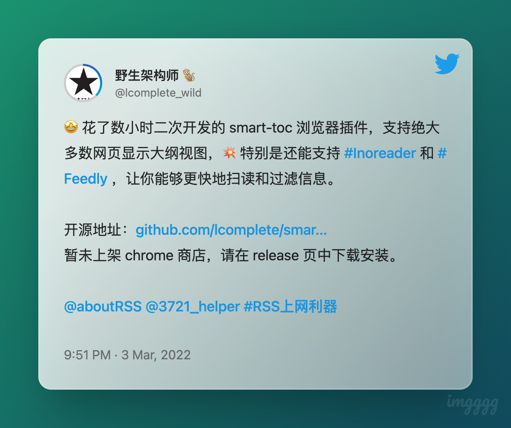

# 009 🌈 Newsletter Of Newsletters、海绵宝宝的智慧

欢迎打开第 009 期「野生架构师」周刊，这是由  [lcomplete](https://twitter.com/lcomplete_wild) 每周发送的 newsletter，本周聊聊 Newsletter 和反常识思维。

## Newsletter Of Newsletters

其实上周就想写一个关于 Newsletter 的主题，因为开始写 Newsletter 自然会关注这个领域的一些内容，也会想表达一些关于它的想法。上周放弃写的原因则是在想写这个是不是没多大「含金量」，而这周我又有了一些新的看法。

工欲善其事，必先利其器，当我们在准备做一件事的时候，最好先把工具准备好，但是要小心不要掉进「玩工具」的陷阱中，工具是层出不穷的，一定会有越来越好用的工具出现，当我们用上新的工具的时候往往会有一种错觉——感觉自己的能力飞跃了。

这样的例子有很多：

- 学习编程：痴迷于 IDE、插件、收集各类的工具类库。
- 学习知识管理：痴迷于研究各种工具，从 Evernote、OneNote、语雀、Flomo、WorkFlowy、Notion、Roam Research、Obsidian、Logseq 研究到 Notepad。
- 学习写作：Typora、iA writer、Ulysses 等等研究个遍。

学习这些工具是有益的，但不要一直停留在这个阶段，要清楚地认识到这是一个 `学徒阶段` ，更不要有工具优越感。

🔖 **不要停留在学徒阶段，但是要永远保持一个学徒的心态。**

对于写 Newsletter 来说，我就是一个学徒，第一要勇于承认这一点，第二跟我一样的学徒还有很多，而我关于 Newsletter 的一些想法可能对他们是有帮助的，就像许多优秀的编程入门文章也是正在学习编程的人所写的一样。

`Newsletter Of Newsletters` 这个词我借鉴了 `Fund Of Funds`（投资基金的基金），对于刚接触投资的人来说，FOF 会是一个不错的选择，对于刚接触 Newsletter 的人来说，我想这样的一份「NON」也是一个不错的入门指引。

### 写 Newsletter 不像看起来那么简单

许多刚接触 Newsletter 这种形式的读者，往往会有个疑问——为什么每篇文章都没有主题。Newsletter 可以翻译为新闻简报，它并不是关于某一主题的具体文章，而是包含多个主题及简要介绍的聚合类信息。有人将它比作 `大杂烩` ，而优秀的 Newsletter 应该是高级大杂烩，我愿称之为 `佛跳墙` 😎。

Newsletter 具体的形式可以有很多种，大多是包含多个主题并对每个主题进行简单介绍，初次接触的人可能会认为写这个很简单嘛，尤其是对于需要接触大量信息的媒体和 IT 工作者来说，好像人人都能写好似的，我见过最离谱的一个 Newsletter 是 revue 上的，作者只在里面放几个链接，由 revue 负责渲染出链接的摘要，我想说这不是 Newsletter ，这只是一个网址收藏夹。

写 Newsletter 并不像看起来那么简单，当我只有零星几个读者的时候，我写的很随心所欲，当我的订阅者达到 50 个的时候，我就开始认真考虑自己写的是否会辜负这份订阅和期待，当我看到更多的 Newsletter 的时候，我在想我写的内容是否太少了，读者能在这里发现好东西吗？希望能够令读者朋友跟我一起进步、一起发现好的事物，每周分享的信息量不能太少，但也不能太多，即要发散，又要收敛，作为学徒，我也还在摸索当中。

### Newsletter 的价值

Newsletter 并非是新鲜事物，但我感觉它正在变的越来越流行，我前不久才加入这场游戏，也感觉到越来越多的人开始进入，在信息井喷的情况下，每周接收一份由「靠谱人士」精选过的「高级大杂烩」确实能解决信息噪音过高的问题。

Newsletter 越流行，那么它的商业价值也是显而易见的，但是关于这一点我没有过多思考，因为我主要是基于 「Learn In Public」的出发点来写作的，付费订阅制从来不是我会去考虑的事情，我也不订阅任何需要付费的 Newsletter ，原因很简单，当需要付费才能查看的时候，信息是无法自由地传播的，我宁愿看到帮助大的文章时打赏下作者。Newsletter 中插广告比起付费订阅，我更支持前者，付费订阅制更适合小圈子。

🧩 简而言之：Newsletter 促进 **高质量** 信息的 **高效** 传播，写的好也能赚钱，写的不好对自己也是种锻炼。

## 海绵宝宝的智慧

> 我准备好了。

🧽 这是海绵宝宝的口头禅。

这个部分，我想聊聊反常识思维。

万事开头难，这是许多人用来安慰他人或自己的话，安慰有时候是一种鼓励，有时候也是一种毒药，它可能让你觉得目前的处境是理所应当的，尼采说过：对一个人最好的安慰就是不要安慰。

刚开始工作一定会很困难吗？刚开始创业一定会很难吗？这是不一定的，不要觉得万事开头难而心安理得，正确的做法是不断地寻找方法，还有就是像海绵宝宝一样，时刻都准备好了。

> Connecting the dots.

乔布斯在斯坦福的著名演讲上讲过这句话，即串联生活的点滴，过去的经历能否帮助现在的你处于一种准备好了的状态呢？

## 本期主题的相关优质资源

特别推荐的 Newsletter ：

- [Geek Plux Lab](https://geekplux.zhubai.love/)
- [程序员的喵](https://catcoding.me/)

反常识思维：

- [降级论](https://meditic.com/degrading-for-success)

## One More Thing

> Talk is cheap, show me the code.

这是 Linus 的名言，这里的 code 我想换成 `product` ，作为开发者，我们毕竟不是作家，所以不光要 `talk` ，更要有自己的 `product` ，`talk` + `product` 也许等于 `freedom` 。

🌈 本周做了一个小工具：[smart-toc](https://github.com/lcomplete/smart-toc)

---

Util next week,

lcomplete