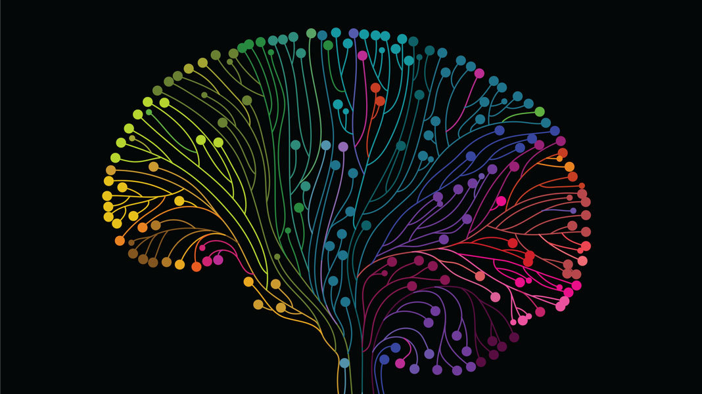
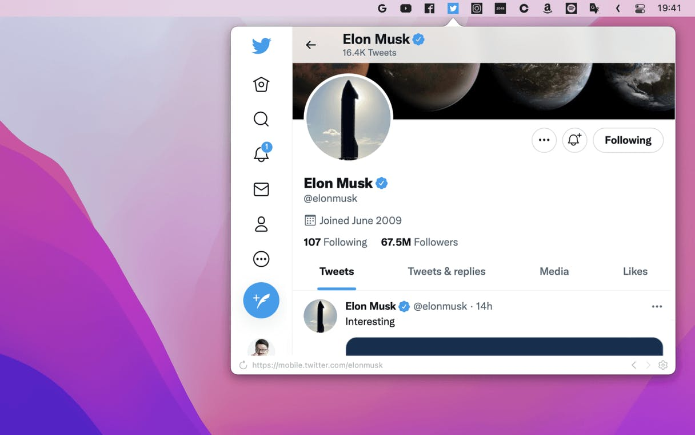

# 010 🚀 Hacking The Mind / 拆掉思维里的墙、放飞想象、打破规则

欢迎打开第 010 期「野生架构师」周刊，这是由  [lcomplete](https://twitter.com/lcomplete_wild) 每周发送的 newsletter，本期的主题是 Hacking The Mind ，不光要拆掉思维里的墙，还要放飞想象、打破规则。

## 🎓 Hacking The Mind / 拆掉思维里的墙

上一期我推荐了 GeekPlux 的 Newsletter，他在 [如何成为某一领域的世界顶尖](https://geekplux.com/newsletters/5) 中提到广度比深度更加重要，我简单概括其中的两个论点：

1. 扩展深度会到达边际效应收窄的阶段；
2. 扩展广度更难，在当今社会，组合运用多种知识更有优势。

第一个论点我在多年前的一次公开演讲上说过几乎一样的话，曾经自学计算机科学想往科研方向发展，到最后放弃走这条路，我对 `边际递减效应` 深有感触，放弃科研目标后，我则尝试扩展自己的广度，因此在阅读这篇文章时，首先我产生了强烈的共鸣，基本上我是认同这两个观点的，那一瞬间我也有些沾沾自喜——多年前就有了这个感悟，然后我便开始反思自己的喜悦情绪，还好，我也知道另外一个道理——当年纪越大，在学习时，我们很容易吸收并加强与自身相似的观点，而排斥不一样的看法。

于是我带着辩证的思维去看这个观点，广度是否比深度更重要，我认为是难以定论的，它们各自的重要性对于科学家和商人来说是不一样的。带着这样的方式去思考，我们可以提取其中有用的知识，而不会使自己的思维越加固化，学习是为了让我们的思维得到延展，而不是筑起高高的围墙。

举两个开发人员在技术领域给思维筑墙的例子：

- 偏爱某种编程语言，工作中需要用到其他语言时十分排斥，甚至认为这会影响个人的职业发展。
- 认为软件测试是测试人员的工作，对测试相关的技术栈一无所知。

> 别自己墙了自己，人最可悲的就是自己限制自己。
>
> 开放，让自己有更多的可能性，能到更高的层次，做更有价值的事，成为更强更好的人……当然，如果你觉得你只想做一个平凡人，也和本文并不冲突……另外你也不要觉得这篇文章是让你要成为一个精英，但你一定要去摸高……这篇文章是告诉你一种面对人生的思考方式，在这种思考方式下，你会有更多的可能性，更大的场景……而不是直接把自己归到“平常人”，把自己“墙”了！
>
> —— 左耳朵耗子：[别让自己“墙”了自己](https://coolshell.cn/articles/20276.html)

## 💥 Hacking The Mind / 放飞想象

拆掉思维里的墙以后我们来放飞下想象，看看技术领域一些新奇好玩、令人意想不到的技术。

### MenubarX

[MenubarX](https://menubarx.app/) 是一个强大的 Mac 菜单栏浏览器，可以把网站添加到菜单上，像 App 一样即开即用。

### 在 CSS 中连接数据库

原文：[Yes, I can connect to a DB in CSS](https://www.leemeichin.com/posts/yes-i-can-connect-to-a-db-in-css.html)

原文较长，简单介绍一下是如何实现的：

1. 利用 [CSS Houdini](https://developer.mozilla.org/en-US/docs/Web/Guide/Houdini) API 中的 `CSS Paint Worklet` 特性，它允许 CSS 在元素上进行绘制。
2. 利用 [sql.js](https://github.com/sql-js/sql.js) ，它是浏览器上的 `SQLite` 。
3. 使用 Houdini API 自定义 CSS 属性 `--sql-query` ，根据属性查询 SQLite 数据库并进行绘制。

### 中文推友自拍转推机器人

<https://github.com/atkio/selfiebot> ，这是一个用 C# 写的 [中文推友自拍转推机器人](https://twitter.com/ratkio) 。

### React 头盔（react-helmet）

[react-helmet](https://github.com/nfl/react-helmet) 是一个为 React 设计的 HTML head 管理器，使用起来是 `dead simple（真特么的简单）` 。

## 🚀 Hacking The Mind / 打破规则

黑客是计算机革命的英雄，让我们来复习一下黑客伦理：

1. 对计算机的访问（以及可能帮助你认识我们这个世界的事物）应该是不受限制的、完全的，任何人都有动手尝试的权利。
2. 所有的信息应该可以自由获取。
3. 不迷信权威。
4. 评判黑客的标准应该是他们的技术，而不是那些没有实际用途的指标，比如学位、年龄、种族或职位。
5. 你可以在计算机上创造出美与智慧。
6. 计算机可以让你的生活更美好。

《黑客与画家》出版至今已经 18 年，18 年前 Paul Graham 写到：`人类社会还没有充分理解程序员对社会的影响以及程序员带来的美和智慧` ，我想现如今已经发生了许多变化，程序员群体越来越庞大，人们也习惯了计算机世界，现今社会在疫情的阴霾下，能够让我们远程工作的计算机让许多人的生活还能维持下去。

无数的人在计算机上创造美妙的产品，施展他们的智慧，黑客与骇客的区别逐渐被大众认识，黑客的精神正在更广泛地被传播。

`ANYTHING IS HACKABLE` ，一个会打破规则的人一定不会是一个思维僵化的人，向黑客精神致敬。

---

Util next week,

lcomplete
