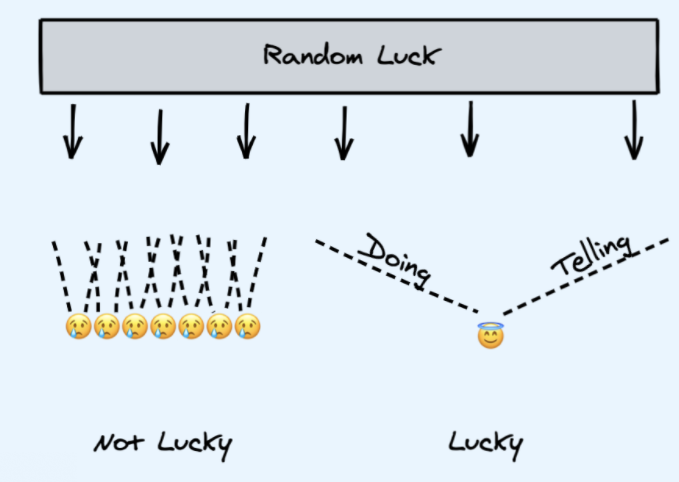
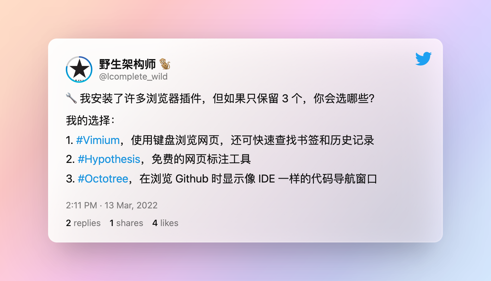

# 011 🖼 Browser = OS 、文章、工具、资源、文摘、言论

欢迎打开第 011 期「野生架构师」周刊，这是由  [lcomplete](https://twitter.com/lcomplete_wild) 每周发送的 Newsletter，本期的主题是「Browser = OS」，另外分享优质的文章、工具、资源、文摘和言论。

## 💡 关于本期周刊

在我前十期的周刊中，整体风格主要是围绕不多于 3 个话题将我想表达的给说出来，这满足了我自己的表达欲，如果能引起一些读者朋友的共鸣或产生帮助，那自然也是非常好的，但这似乎是次要的，这种周刊写法并不能很好地完成分享高质量信息的初衷。

在我自己阅读 Newsletter 的过程中，话题性的文章除非写的特别优秀，否则很难对我产生实质性的帮助，而 `高级大杂烩` 形式的 Newsletter 往往令我收获更大，这里面最优秀的要属 [阮一峰的科技周刊](https://www.ruanyifeng.com/blog/weekly/) ，基本上每一期都能在其中发现优质有趣的信息，所以本期周刊也采用阮一峰科技周刊的形式，以表敬意。

注：我在 [009 🌈 Newsletter Of Newsletters、海绵宝宝的智慧](./009.md) 这期提到 `高级大杂烩` 形式的 Newsletter。

## 📝 本期话题：Browser = OS

连续几期在周刊前面使用英文开头，这其实并非刻意为之，这一期我先尝试使用中文来写主题，但写出来都较冗长，所以干脆使用英文，更能简洁地表达话题含义。

### 浏览器跟操作系统并无本质区别

浏览器跟操作系统是否有本质上的区别，这是一个有争议的话题，在 v2ex 上也曾经有一个热门的帖子讨论过，有些人说浏览器在操作系统面前只是个弟弟，怎么能和操作系统相提并论呢？诚然，如果严格从技术上去区分，这两者必然不是同一类东西，但是从使用的角度，他们有本质上的区别吗？实际上是没有的，`Browser 和 OS 上都能够承载 App`，都有其生态，OS 上的 App 比 Browser 上的 App 权限大一些、能调用的 API 多一些而已。

### 浏览器倒逼操作系统进化

微软的前总裁鲍尔默在 10 多年前也表达过浏览器和操作系统并无实质差别的观点，这些年 `Chrome OS` 在国外大行其道，越来越多优秀的 Web App 涌现：Figma、Notion 等等，这些足以表明浏览器的地位越来越高，直逼操作系统。我想这也是承诺 Win10 会是最后一个版本的微软又推出 Win11 的一大原因，不光是 Win11，据说 Win12 也在开发中，`随着网络越来越发达，浏览器越来越强大，操作系统也需要进化`。

操作系统的进化对于科技工作者来说是喜闻乐见的，所以我曾第一时间安装了 Win11，但结果令我还是略微失望，除了界面更加美观、系统设置更加统一外，带来的更多的是一系列问题，尤其是一些常用软件：飞书频繁卡顿、Logseq 卡顿，虽然这些不能全赖 Win11，但使用体验确实大打折扣，希望这些问题能够尽快得到解决，正式版能够尽快推出。

### 浏览器越强大，不同操作系统的差别越小

经过这么长时间 Win11 的使用，让我越发觉得 `Mac OS` 的优秀，不仅界面美观、操作统一，最重要的是乔老爷子提倡的`软硬件结合`做的非常优秀，我的 Macbook Pro 为 18 年的老款，内存只有 8G、CPU 也仅为 i5，但却很少发生卡顿，虽然大多数时候是轻度使用，开发时基本只开一个 IDE，不像在办公使用 PC 时经常需要打开许多 IDE，但它很好地满足了这些场景下的需求，如果升级到 M1 Max，那绝对是令人心动的体验。

程序员应该使用 Mac OS、Windows 还是 Linux，这在 v2ex 上几乎是一个月经话题，我曾经也做过一个长回复，可惜找不到了，我的回答简单说就是：`都用`。只有都使用过，我们才能明白其中的设计内涵，`在使用过程中，我们会潜移默化地提升自己使用软件和设计软件的能力`。

我是重度的 Windows 用户 + 偏重度的 Mac 用户 + 轻度的 Linux（桌面端）用户 + Chrome OS 用户，因为使用过这么多系统，所以我能够非常流畅地在各个操作系统之间切换，这除了软件使用能力的提升外，另一个非常重要的点就是，其中的核心软件 `浏览器，并没有改变`。

因为 `浏览器的功能越来越强大，不同的操作系统能够更好地无缝切换`，所以现在已经不像多年前，需要在 Win、Mac 和 Linux 中做出选择，在条件允许的情况下，我觉得对于程序员来说，这些系统都应该去使用。那么操作系统上层的 `Browser OS` 更是重中之重，值得我们花时间去深入学习，以便将它充分利用。

### Web App 和插件共同组成了浏览器上的软件生态

如何用好浏览器，最重要的一点就是 `扩展浏览器的能力`，这就需要用到 `插件` 了，Vimium、沙拉查词、AdBlock 等等插件能够大幅提升我们的效率，由于都是在浏览器的环境中，这些插件不仅起到相互协同的作用，同时它们的能力又能附加到无数的 Web App 中，未来插件市场会越来越丰富，和 Web App 一同构建起 Browser OS 中的软件生态。

### 浏览器领域的创新

既然 `Browser` 的地位这么高，在浏览器领域有没有一些创新呢？接下来分享一些这方面的创新项目：

1、[Vivaldi Browser](https://vivaldi.com/)

由前 Opera CEO 创办的 Vivaldi 浏览器，它将许多常用的插件（AdBlock、摘要笔记等）直接集成到了浏览器中，使其开箱即用，另外还有一些增强功能：标签分组、在侧边栏中可以将网页进行固定等。将网站 `pin` 起来的理念是：将这些网页当作 App，使其能够快速访问。[MenubarX](https://menubarx.app/) 这个 Mac 上的软件实际上也是应用了这个理念。

2、[Browserless](https://www.browserless.io/)

模拟浏览器运行一般会用到 Selenium、Playwright 或 Puppeteer，使用这些技术都存在着环境不一致的问题，因此最好将它们放在 docker 中运行。Browserless 是一个云服务，它允许客户端连接并控制服务端 docker 中运行的无界面浏览器，也可以利用它在公司内部搭建一套这样的服务，统一自动化执行环境。

3、[Mighty](https://www.mightyapp.com/)

你有没有抱怨过 Chrome 运行变慢，内存占用过多？Mighty 的出现就是为了解决这个问题，它使用串流技术，让你能够使用云端超强电脑中的浏览器。我们对云游戏的概念并不陌生，因为运行游戏需要较高的计算资源，而云上网有没有潜力呢？虽然许多人并不看好这个项目，但如果未来网络带宽足够便宜、云资源像水电一样计费真能实现的话，云上网未尝不可，即使云上网的模式失败，相信串流技术在未来一定会有越来越多的运用。

## 📖 文章

1、[⭐51W+ 的终端命令行工具助你成为 10 倍程序员](./../10x/terminal.md)

英文版：[10 Command Line Tools Every Developer Should Know](https://enlear.academy/10-command-line-tools-every-developer-should-know-7f9b5e9ee07)

这是我去年花了一点点时间写的文章，交给 `bytefish` 翻译到 Medium 上，截止到目前，1 个月的时间，获得了 $150 的收益。

2、[你可以创造运气](https://catcoding.me/p/weekly-1/)

`程序员的喵` 写的第一篇周刊型文章，我在 Newsletter 中已经多次提到过他，以往写作我觉得不应该重复，不过现在我觉得也不要紧，高质量的信息就是应该重复出现。

最近也越来越体会到写作可以创造 `Luck Surface Area`，by the way，我创建了一个 Telegram 频道 [Luck Info Hunter](https://t.me/luckinfohunter)。

3、[黑客原则](https://github.com/nusr/hacker-laws-zh)

hacker-laws-zh，💻📖 对开发人员有用的定律、理论、原则和模式，[hacker-laws](https://github.com/dwmkerr/hacker-laws) 的中文翻译。

4、[It's time to win](https://jakobgreenfeld.com/time-to-win)

互联网、社交平台、社交状态、粉丝数、影响力、发言、表达，这不是一场在线游戏吗？

It's time to win [The Great Online Game](https://www.notboring.co/p/the-great-online-game).

5、[The salesman and the developer](http://swombat.com/2012/5/11/salesman-developer)

一篇老文，讲销售员和程序员的故事，销售员和程序员一块去捕熊，销售员把熊引到屋子，对程序员说交给你了，说完后得意洋洋地又去找熊了。

6、[Why […‘👩‍❤️‍💋‍👨’] returns [‘👩’, ‘‍’, ‘❤’, ‘️’, ‘‍’, ‘💋’, ‘‍’, ‘👨’] in JavaScript?](https://medium.com/frontend-canteen/why-%EF%B8%8F-returns-%EF%B8%8F-in-javascript-7b890e3a13b2)

帮我翻译文章的 `bytefish` 写的，很有意思的 emoji 科普。

7、[The Most Important Skill Nobody Taught You](https://medium.com/personal-growth/the-most-important-skill-nobody-taught-you-9b162377ab77)

Medium 上最热门的一篇文章，讲的是 `独处的艺术`。

## 🛠 工具

1、[Kubernetes YAML Generator](https://k8syaml.com/)

在线生成 k8s yaml 文件。

2、[MarkDownload](https://chrome.google.com/webstore/detail/markdownload-markdown-web/pcmpcfapbekmbjjkdalcgopdkipoggdi)

将网页拷贝为 markdown 格式。

3、[Smart TOC / 智能网页大纲](https://chrome.google.com/webstore/detail/smart-toc-%E6%99%BA%E8%83%BD%E7%BD%91%E9%A1%B5%E5%A4%A7%E7%BA%B2/ppdjhggfcaenclmimmdigbcglfoklgaf)

鄙人二次开发的浏览器插件，智能生成网页大纲，支持 Inoreader 和 Feedly。

4、[EmojiAI 😃](https://emojiai.com/)

输入文字，自动帮你挑选 emoji ，挑不到合适的就来 [EMOJIALL 😊](https://www.emojiall.com/zh-hans) 找吧。

5、[Poet.so](https://poet.so/)

将推文转换成好看的图片。

6、[Ray.so](https://ray.so/)

将代码转换为好看的图片，Raycast 团队出品。

7、[Scoop](https://scoop.sh)

Windows 下的命令行安装器。

8、[OhMyStar](https://ohmystarapp.com/)

Mac 下组织 Github Stars 的工具，类似的工具还有 [Remu](https://github.com/zenghongtu/Remu)、[Astral](https://app.astralapp.com/)。

9、[Fig](https://fig.io/)

在终端添加 IDE 风格的智能提示，目前仅在 Mac OS 下可用，另外该团队还上线了 [shell.how](https://www.shell.how/)，这是一个解释 shell 命令如何工作的网站。

## 🗂 资源

1、[What To Tweet?](https://whattotweet.com/)

从这里可以发现写推文的灵感。

2、[Open-source alternatives](https://opensource.builders/)

在这里找到热门 App 的开源替代品，比如：

- 1Password：<https://github.com/bitwarden/server>
- Zapier：<https://github.com/actionsflow/actionsflow>
- Airtable：<https://github.com/nocodb/nocodb>
- Notion：<https://github.com/AppFlowy-IO/AppFlowy>
- Firebase：<https://github.com/supabase/supabase>

3、[Unsplash](https://unsplash.com/)

提供免费可供使用的图片。

4、[awesome-cli-apps](https://github.com/agarrharr/awesome-cli-apps)

一个关于命令行 app 的收藏列表。

5、[PodLetter](https://www.podletter.club/)

Podcast 和 Newsletter 导航网站。

6、[独立开发变现周刊](https://github.com/ljinkai/weekly)

分享独立开发、产品变现相关内容，每周五发布。

## 📋 文摘

1、[The Most Important Skill Nobody Taught You](https://medium.com/personal-growth/the-most-important-skill-nobody-taught-you-9b162377ab77)

人类的所有问题都源于人类无法独自安静地坐在房间里。——Pascal

问题的根源在于我们从未学会独处的艺术。

在互联网时代，这个问题已经被放大了。

你越不喜欢独处，就越有可能不了解自己。

我们对孤独的厌恶实际上是对无聊的厌恶，从不面对这种虚无就是从不面对自己。

正确的做法是面对它。

不要害怕独处，它提供了认识自己的绝佳机会。

腾出时间，无论是每天还是每周，只是静坐一会儿，思考一下我们的想法，我们的感受，它能为我们带来鼓舞和激励。

「了解你自己」是世界上最古老的哲学智慧，独处不能解决所有问题，但它是一个好的开始。

2、[架构师应该接受低代码的 5 个理由](https://www.infoq.cn/article/bPgOisT3rrmTjLAjCcf2)

1. 减少技术债务
2. 更好的新员工体验
3. 简化工作流程和数据集成
4. 自动化更多业务流程
5. 加速数字化转型

## 📜 言论

> 前不久，来自美国的一项医学研究表明了这一点：视神经细胞只要受到蓝光 8 分钟刺激，就会让身体持续兴奋超过 1 小时。而且调查还发现，比起其它应用来说，刷抖音后入睡所需要的时间最久，因为刷抖音会更加刺激肾上腺素和多巴胺的释放，给人「快乐」的感觉，所以睡眠会不断延后。——[极客简报](http://www.geekpark.net/news/299373)

> The key is not to discard The Box of Daily Experience and find a new one — it’s to warmly embrace the one that we have now — with its joys, its flaws, and everything in between. ——[Travel Is No Cure for the Mind](https://moretothat.com/travel-is-no-cure-for-the-mind/)

---

Util next week,

lcomplete
