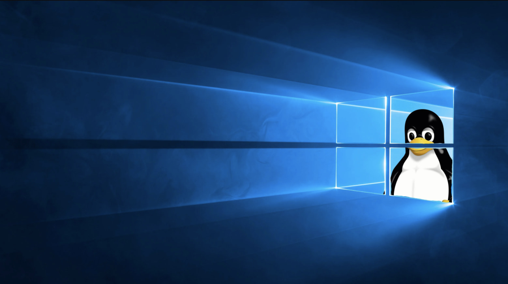
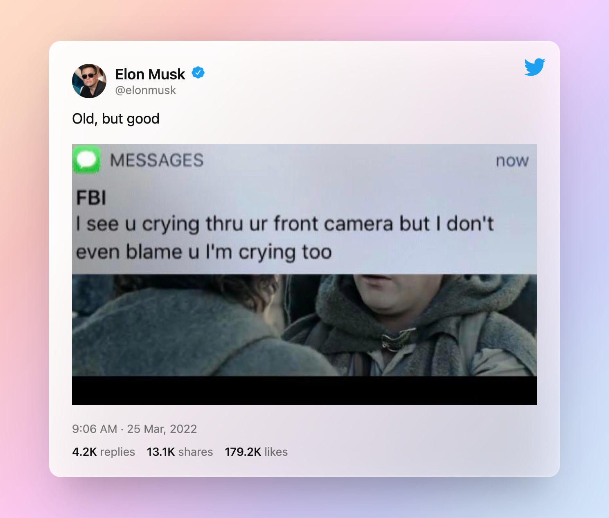

# 012 📸 Old But Good 、UNIX 艺术、互联网历史博物馆

欢迎打开第 012 期「野生架构师」周刊，这是由  [lcomplete](https://twitter.com/lcomplete_wild) 每周发送的 Newsletter，本期的主题是「Old But Good」，同时也带大家一同回味 UNIX 的经典艺术。

## 📝 本期话题：Old But Good

本期话题由 Elon Musk 贡献 🤣，我特别喜欢这条推文，第一当下我们确实是生活在层层监控之下，第二电影《指环王》的这段剧情确实很感人，我当时看的时候也有些热泪盈眶，这段剧情的台词也非常励志，一起来感受一下。

> 山姆：这就像精彩的故事和伟大的事迹总是充满了黑暗和危险。
>
> 有时候你不想知道结局，因为哪里会有快乐结局？发生这么多可怕的事，这世界怎么回到从前？
>
> 但是可怕的黑暗和阴影终将消失，崭新的一天将会来临，太阳也会散发更明亮的光芒。
>
> 这才是让人永生难忘、意义非凡的故事，纵使你太年轻不明白为什么，但是我想我明白了，我现在明白了。
>
> 这些故事里的主角，有很多机会半途而废，但是他们并没有，他们决定勇往直前。
>
> 因为他们抱着一种信念，什么样的信念？
>
> 那就是——这世上一定存在着善良，值得我们奋战到底。

回想这段台词时，又想到了当今世界之现状，令我感触更深，但愿疫情和战争早日过去。

不管是电影还是技术，总是在推陈出新，Newsletter 也总是分享最新的时事、文章或工具，经典内容似乎有被遗忘的趋势，于是本期周刊着重分享那些历经时间考验的经典书籍和文章等内容。

## 🎼 UNIX 艺术

### 🎶《UNIX 编程艺术》

这本书的作者是 Eric S. Raymond，简称 ESR，他有一句名言，「`足够多的眼睛，就可让所有问题浮现`」。他是 [《大教堂与集市》](https://m.douban.com/book/subject/25881855/)、[《如何成为一名黑客》](https://translations.readthedocs.io/en/latest/hacker_howto.html)的作者，也是早期的开源运动领导者之一。

这本书着重讲解了 UNIX 的哲学、历史和设计，作为技术书籍中的瑰宝，其中的内容可谓是字字珠玑。

UNIX 哲学是这样的：`一个程序只做一件事，并做好`。从整体上，可以概括为以下几点：

1. 模块原则：使用简洁的接口拼接简单的部件（封装性、紧凑性、[正交性](https://xie.infoq.cn/article/aa02e2aae865239b69312622e)、[真理的单点性 / SPOT 原则](https://en.wikipedia.org/wiki/Single_source_of_truth)）。
2. 清晰原则：清晰胜于机巧。
3. 组合原则：设计时考虑拼接和组合。
4. 分离原则：策略同机制分离，接口同引擎分离。
5. 简洁原则：设计要简洁，复杂度越低越好。
6. 吝啬原则：除非没有办法，不要编写庞大的程序。
7. 透明性原则：设计要可见，以便审查和调试。
8. 健壮原则：健壮源于`透明`和`简洁`。
9. 表示原则：将数据与逻辑分离，使逻辑质朴和健壮（单元测试很依赖这一点）。
10. 通俗原则：避免标新立异（惯例优先）。
11. 缄默原则：如果程序没什么好说的，就沉默（不要分散用户的注意力，只显示最有用的信息）。
12. 补救原则：出现异常时，要给出足够的错误信息。
13. 经济原则：宁花机器一分，不花程序员一秒。
14. 生成原则：避免重复编码，尽量编写程序去生成程序。
15. 优化原则：先求运行，再求正确，最后求快。
16. 多样原则：多语言、开放的可扩展系统和用户定制机制。
17. 扩展原则：设计着眼于未来。

🎵 Unix 哲学浓缩为一条铁律，那就是 K.I.S.S 原则——Keep It Simple，Stupid！

作为 Coder，其中很多原则我们都已经烂熟于心，有一些可能还没有领会的特别深刻，那就需要我们常读常新，比如：

1、在生成原则上，只要我们不断思考，发现项目中重复的地方并消灭之，必然能使我们的生产力得到极大的解放。

在前后端开发协作上，最多的工作之一就是接口联调，那我们可以运用 `生成原则` 来优化工作流程，使用 [OpenAPI Generator](https://github.com/OpenAPITools/openapi-generator) 或是其他工具来生成代码，有必要时编写自己的代码生成器。

当下的低代码热潮，本质上也是将生成原则发挥到极致——数据即代码。

2、在模块原则上，UNIX 上的许多微型语言体现了紧凑性，如：正则表达式、awk、Emacs Lisp 等，`更具表达力的语言意味着程序更短，bug 更少`，awk 极大地方便了文本处理；许多 LeetCode 问题，如果采用正则表达式能够极大地简化解法，甚至可以 [用正则表达式来检查素数](https://coolshell.cn/articles/2704.html) 。

这本书还引用了不少 [《程序员修炼之道》](https://book.douban.com/subject/35006892/) 中的内容，后者是该书内容极好的补充，由 [云风](https://blog.codingnow.com/) 于 2020 年才翻译了第二版，距离第一版已过 15 年，足见这本书的历久弥新，同时第二版的翻译也优秀许多。

相关文章：

- [《大教堂和集市》笔记 ｜ 阮一峰的网络日志](http://www.ruanyifeng.com/blog/2008/02/notes_on_the_cathedral_and_the_bazaar.html)
- [数据即代码：元驱动编程 ｜ 酷壳](https://coolshell.cn/articles/10337.html)

### 📹 推荐记录片

1、[代码奔腾 Code Rush (2000)](https://www.bilibili.com/video/BV1rx411E7oW)

这部纪录片讲的是网景公司在与微软的竞争中失败，最终将代码开源的故事。

虽然网景失败了，但本片的片尾词，至今仍然适用，仍然可以激励着互联网上的程序员们。

> 互联网也仍然继续发展着，进入到每个人日常生活的各个角落，而程序员军团和他们的代码也并肩前行，奔腾着，直到深夜。

We Are Coders，今生无悔写代码。

2、[代码 The Code (2001)](https://www.bilibili.com/video/BV1us411z7X4)

Linus、ESR 和 RMS 等对自由软件和开源运动有着卓越贡献的人「主演」的影片，也可以说是 Linux 的纪录片。

3、[操作系统革命 Revolution OS (2021)](https://www.bilibili.com/video/BV1iC4y187nT)

「主演」仍然是 Linus、ESR 和 RMS 等人，1999 年 Red Hat 在纳斯达克上市，Linux 那几年风头无两，这些领袖人物一年拍两部纪录片也就不奇怪了 🤣，这部影片中 ESR 的「戏份」比较多，还担任了开场大使。

《The Code》讲述的更多是 Linux 的历史，而这部影片则侧重讲建立 Linux 操作系统的斗士们是如何奋起反抗垄断的，正如本片片头，ESR 对轻蔑他的微软员工说到「I'm your nightmare」一样。

## 🗃 互联网历史博物馆

<https://web.archive.org/> 是一个保存互联网档案的网站，于 1996 年创办，目前已经保存了 6690 亿个页面，它的目标是将互联网的历史档案给记录下来，在这里可以找到已经关闭的网站的历史存档，像我多年前上线过的网站也能够找到。

这是一个非营利性组织，主要依靠创始人 [布鲁斯特·卡利](https://zh.wikipedia.org/wiki/%E5%B8%83%E9%AD%AF%E6%96%AF%E7%89%B9%C2%B7%E5%8D%A1%E5%88%A9) 雄厚的财力支撑。

当我们打不开网站时，可以到这个`网站时光机`查找存档，它提供了一个插件 [Wayback Machine](https://chrome.google.com/webstore/detail/wayback-machine/fpnmgdkabkmnadcjpehmlllkndpkmiak?utm_source=chrome-ntp-icon)，可以存档网站或者从打不开的页面快速跳转到「时光机」。

## 🤣 轻松一刻

> [为什么程序员喜欢 UNIX?](https://coolshell.cn/articles/1941.html#%E4%B8%BA%E4%BB%80%E4%B9%88%E7%A8%8B%E5%BA%8F%E5%91%98%E5%96%9C%E6%AC%A2UNIX)
> 
> unzip, strip, touch, finger, grep, mount, fsck, more, yes, fsck, fsck, fsck, umount, sleep

---

Util next week,

lcomplete