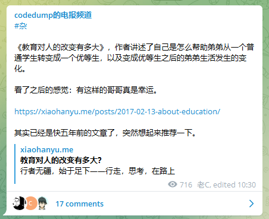

# 013 🔭 重新掌控自己的信息

欢迎打开第 013 期「野生架构师」周刊，这是由  [lcomplete](https://twitter.com/lcomplete_wild) 每周发送的 Newsletter，本期的主题是「重新掌控自己的信息」，另外分享优质的文章、资源和言论。

📬 由于清明假期回老家时忘记带笔记本电源，导致本期周刊延期发送，`本周我将发送两篇周刊`。

## 📝 本期话题：重新掌控自己的信息

Take back control of your news feed，这是 Inoreader 的 slogan，在习惯了被算法喂养信息的时代，掌握获取信息的主动权至关重要，这期话题讨论一下如何掌控自己的信息，并对我刚开始做的一款信息产品做一个简介，欢迎读者朋友们参与讨论。

### TL;DR

1. 掌控信息源只是开始，不管是通过推荐还是订阅获取信息，我们都需要主动更新信息源。
2. 做一个会改造发动机的赛车手，作为程序员在善用佳软的同时也要根据需要打造自己的工具。
3. Stay Hungry, Stay Foolish，信息管理是一个不断优化的过程，不能满足于现状。
4. 我在做这样一款信息工具：它可以在本地记录我们上网浏览过的信息，包括文章、微博等形式的内容，提供类似 Everything 的快速检索方式，并以良好的信息归类方式进行呈现，辅助我们取回看过的信息。

### 从掌控信息源开始

张一鸣曾经也是 Google Reader 的早期用户，但他一直不看好其发展，因为他认为 RSS 订阅需要用户有出色的信息管理技能，这对用户端的要求太高，注定是做不大的，他认为更好的方法是根据用户的行为和喜好通过算法来推荐内容，于是有了今日头条。

推荐算法比主动订阅信息更容易筑造 `信息茧房`，但这并不是说主动订阅的方式就更加高人一等，实际上不管用哪种方式，只要主动地去获取新的信息，都能够避免 `窄化自己的信息世界`。

避免推荐算法给我们做茧的一个好方法是 `主动搜索信息`，以丰富推荐的内容，`主动驯化` 推荐机器。

主动订阅信息则要求我们丰富订阅渠道和订阅对象，订阅渠道有很多，如：RSS、推特、微博、邮件、Telegram、Slack 等等，这些都是订阅方式，掌握这些工具的用法后，剩下的就是找到需要订阅的对象，我们可以：

1. 从热门中找，比如 [热门的 Medium 作者](https://topauthors.xyz/)、[热门的 Medium 文章](https://topmediumstories.com/)、[热门开发文章推荐](https://app.daily.dev/)。
2. 保持好奇心，顺腾摸瓜，当关注了一个优质博主时，看看他的友链、推荐和引用，往往就能发现更多的优质信息源。
3. 订阅高质量周刊，在信息过载的时代，以周的维度浏览精选信息是一个不错的方式。

### 做一个会改造发动机的赛车手

RSS 阅读是我喜欢的信息处理方式，我将网站订阅、推特、Telegram 频道和 newsletter 都聚合在 RSS 阅读器中查看和记录，这已经满足了我的大部分需求，然而即便如此也还是有许多想获得优化的地方，所以我时常想自己做个 RSS 阅读器。

在我还没听说过今日头条之前，我也有一个类似的想法，于是花了两个晚上做了一个 [程序猿信息盒子](https://github.com/lcomplete/coderinfo)，它能自动聚合我常看的网站的信息，本来还计划做文章相似度匹配和关键词提取，这样就能获取到近期的热点文章，但由于种种原因而搁置了。

市面上并没有全能的信息处理产品，这种工具也不可能存在，所以不少程序员会自己写工具去优化信息处理，比如：

- 作者给自己用的 Web 应用，搭配 Obsidian 使用，详情：[打造自己的工具](https://catcoding.me/p/intro-to-obweb/)——程序员的喵。
- 作者为了方便阅读论文，为自己开发的划词翻译工具，使用了 DeepL 的 API，作者也公布了 API 的设计，详情：[DeepL Api 设计中的欺骗战术](https://zu1k.com/posts/thinking/deception-tactics-in-deepl-api-design/)，值得一读。

也有做成产品或开源的：

- 定位为信息处理粘合剂的简悦：<https://simpread.pro/>。
- 用中文浏览国外社交媒体里的热门讨论：<https://www.buzzing.cc/>
- 让 Newsletter 支持 RSS 订阅：<https://kill-the-newsletter.com/>。

🔖 很多优秀的赛车手会自己改造发动机和变速器，软件工程师好比 IT 界的赛车手，必须掌控自己的车子。

### Stay Hungry, Stay Foolish

市面上有优秀的产品和别人造好的轮子，似乎可以满足绝大多数需求，但我们不能因为用上了好工具而止步不前，而是要不断优化对信息的掌控，有很多可以优化的点，比如：

1. 前面讲过，要不断去寻找优质信息源、驯化推荐机器，做到这些，我们甚至可以把抖音调教成一种好的学习方式。
2. 寻找优质信息源是一个费时的过程，需要不断提升其效率，与优秀的人交流是一个不错的方式。
3. 不同信息源的处理方式是不一样的，比如对于特大新闻我们希望第一时间收到消息，而知识类信息不需要实时性但最好有回顾机制，英文信息可能有中英对照的需求。
4. 相同信息源的阅读方式是不一样的，有人用 RSS 聚合信息，有人用 Slack 聚合信息，也有人用 Telegram 聚合信息，他们各有优劣。
5. 掌控信息是全方位多维度的，有了良好的输入源，还需要强化甄别筛选、深度阅读、笔记摘要、批判式思考等能力。
6. 信息输入太多，要避免信息过载，能不能让一些信息处理变得更轻松一些？

### 我在开发的一款工具

我在做这样一款信息工具：它可以在本地记录我们上网浏览过的信息，包括文章、推特、微博等形式的内容，提供类似 Everything 的快速检索方式，并以良好的信息归类方式进行呈现，辅助我们取回看过的信息。这是最核心的功能，取回看过的信息后可能还会增加二次处理的功能，比如 `Save To` 这类。

💡 这款工具的理念是这样的——你只管看，我帮你记，需要的时候快速调取出来，扩充第二大脑。

我们使用网络的时间越来越长，有这样一款工具相当于间接提升了阅读的能力，让我们在信息处理、写作和交流上都能获得更大的优势。

如果你对这款工具感兴趣的话，欢迎回复邮件与我沟通，可以谈谈你对这款工具的看法、期望的功能或者你觉得较合理的定价。

🌈 这款工具我会做成免费使用+高级功能付费使用的方式，`本月回复周刊或联系我参与讨论的朋友，在工具做好后我将免费赠送一份。`

## 📖 文章

1、[湾区日报是如何运作的？](https://wanqu.co/b/7/%E6%B9%BE%E5%8C%BA%E6%97%A5%E6%8A%A5%E6%98%AF%E5%A6%82%E4%BD%95%E8%BF%90%E4%BD%9C%E7%9A%84/)

虽然湾区日报停运了，但这种分享的精神不会停止，很多人包括我，都在做着类似的事情，在资源部分我会推荐一些类似湾区日报的频道。

2、[教育对人的改变有多大？](https://xiaohanyu.me/posts/2017-02-13-about-education)

作者的弟弟原本是一个差生，但不知道为何突然醒悟了，而后开始好好学习并考上了香港理工大学。

作者对弟弟转变的契机并没有确切答案，不过我倒觉得转变其实并非一蹴而就的，一定是曾在心底埋下了学习的种子，才会「突然醒悟」。

3、[如何成为一个学习机器](http://blog.jiayuanzhang.com/post/how-to-be-a-learning-machine/)

Jiayuan 的博文，这篇文章讲的是作者从《巨人的工具》这本书中所「偷取的巨人的智慧」，值得学习。

4、[巨人的笔记](https://hutusi.com/articles/notes-of-titans)

来自「胡涂说」的博文，记录《巨人的工具》和《巨人的方法》的读书笔记，作者目前保持更新，值得关注。

5、[But life had other plans ...](https://danlebrero.com/2022/03/23/but-life-had-other-plans/)

生活就像一盒巧克力，你永远不知道下一块是什么味道。

6、[Meet your new Email Marketing Manager](https://jobsapp.info/basecamp/)

这是一封定向的求职信，作者直接告诉 Basecamp 为什么选择自己是对的，如果有心仪的目标公司，不妨试试这样求职。

7、⭐ [拼音猜成语](https://limboy.me/posts/idiom/)

拼音猜成语是一个受 Wordle 启发的一个中文成语小游戏，高峰期 PV 达到上百万，游戏挺好玩，作者还将代码开源了 <https://github.com/limboy/idiom>。

## 🗂 资源

1、[不求甚解 | Telegram 频道](https://t.me/fakeye)

推荐各种产品，有点像 Product Hunt 的推特，但是介绍的更详细，内容也更贴近国人。

2、[Find Blog👁 发现博客 | Telegram 频道](https://t.me/FindBlog)

一个收录优秀博客的地方。

3、[Buzzing | Telegram 频道](https://t.me/buzzingcc)

用中文浏览国外社交媒体里的热门讨论。

4、[codedump 的电报频道 | Telegram 频道](https://t.me/codedump_notes)

一个老程序员发布个人博客、想法、推荐的地方，刚刚发现他也推荐了 [教育对人的改变有多大？](https://xiaohanyu.me/posts/2017-02-13-about-education/)。

5、[电报开拓地 🌠 | Telegram 频道](https://t.me/r231470)

此频道为网友推荐：博客、前沿、信息源、互联网相关优质内容。

6、[程序员资源分享频道 | Telegram 频道](https://t.me/gotoshare)

左耳朵耗子创建的程序员资源分享频道，相信不用过多介绍。

7、⭐ [国内开发者 | 推特列表](https://twitter.com/i/lists/1499242372076830720)

我在 Vue 作者尤雨溪的一条推特上分享了这个列表，[这条推文回复](https://twitter.com/lcomplete_wild/status/1509506553325391878) 为我带来大概 100 多个推特关注，这个列表更是获得超过 700 多个人的关注。

这个列表中的成员不会放很多，挑选的是开发方面分享较多的推特用户。

## 📜 言论

> 灵活的人让自己适应世界，不灵活的人坚持让世界适应自己。结果，一切进步都来自不灵活的人。——— 萧伯纳
>
> 阅读自：[Eson Wong's Blog](https://blog.esonwong.com/weekly-2022-03-14/)

> Motivation comes and goes. If you want to do something consistently, then don't pick a level of difficulty that requires great motivation.
>
> Make it easy enough and simple enough that you'll do it even when you don't feel very motivated.
>
> ——[3-2-1: Motivation, criticism, and the goal of adulthood](https://jamesclear.com/3-2-1/march-24-2022)

---

2022-4-7

lcomplete
