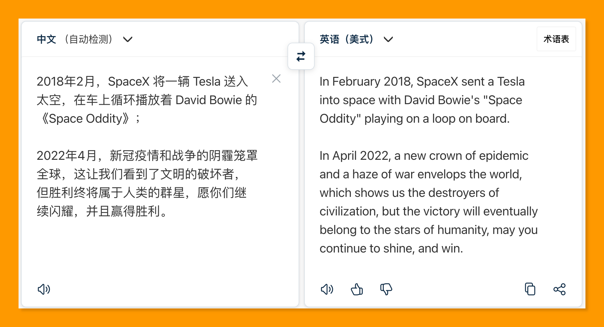
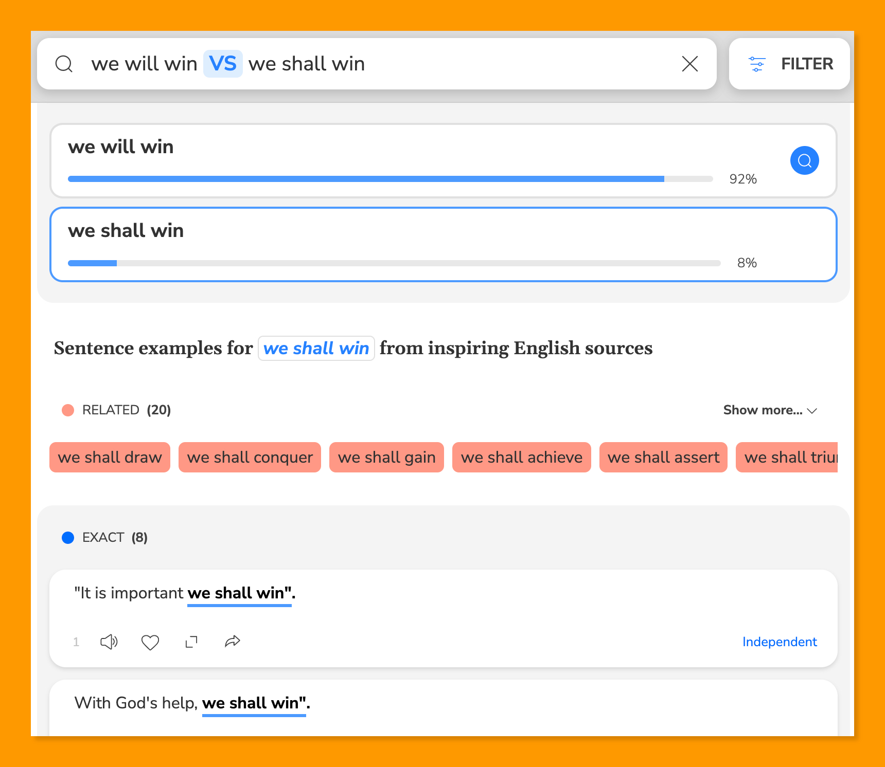

# 015 🍻 内卷时代的软件和自媒体

欢迎打开第 015 期「野生架构师」周刊，这是由  [lcomplete](https://twitter.com/lcomplete_wild) 每周发送的 newsletter，本期的主题是「内卷时代的软件和自媒体」，另外分享由其引出的 `English`、`Code` 和 `Media` 的相关优质内容。

## 📝 本期话题：内卷时代的软件和自媒体

著名的硅谷投资人 Naval，在他的 twitter 首页一直置顶着他那篇著名的[《How To Get Rich (without getting lucky)》](https://twitter.com/naval/status/1002103360646823936)（又名财富三十九章经），有许多人翻译这篇推文串，阮一峰在 [《科技爱好者周刊（第 107 期）：致富与杠杆》](https://www.ruanyifeng.com/blog/2020/05/weekly-issue-107.html) 这篇周刊中也写到了这个话题，感兴趣的朋友可以看看。

其中有许多饱含智慧的观点，但最引人注目的还是这条：

💰 财富增长需要杠杆，在互联网时代，最好的杠杆就是软件和自媒体（`code and media`），因为他们都可以大规模复制并且边际成本接近于 0 。

如果把软件和自媒体结合，这种杠杆又能成倍放大，所以很多人说程序员是最容易实现财务自由的一群人，当然前提是要具备开发软件和创作的能力。

> English, code, write, speech, read。这个时代复利最高的五件事。
>
> 不会英语，就没法了解这个世界上正在发生的最重要的事。不会 code，无法让自己的想法变成现实。不会 write 和 speech，无法凝聚人，也无法把自己的想法传递给其他人。
>
> ——[@Luozhu](https://twitter.com/LuozhuZhang/status/1497968358813143047)

拆解一下这 5 件事情：

`English`，如果是复利最高的事情之一，那么以英语为母语的人具有天然的优势，但当我们学好英语后我们的优势将大于他们，毕竟这世界上超过 14 亿人都在使用中文，而英语母语者大多数不会学习第二门语言。

`Read`，想要输出必须先输入，高质量的阅读是必不可少的；

`Code`，写代码不仅是程序员的专属技能，现在许多岗位都可以通过代码来提升工作效率，随着 AI、低代码等的发展，未来编程会成为一件更容易的事情；

`Write` 和 `Speech` 都是一种 `Media` 的形式，现在结合这两者制作视频更容易带来流量，如果输出的是 `Code` 方面的内容，更是绝佳的组合。

理想很美好，现实曾经也很美好，先知先觉的人早已获得了第一桶金，而这么多年过去了，已经有大量的人开始从事这方面的工作，这原本应该是一件好事情，但是有太多的人只顾追求流量，从而加剧了这个行业的内卷。

上一期周刊[《🚮 中国互联网的三个问题》](http://weekly.codelc.com/issues/issue-1123870)中也提到了相似的问题，而事后我对上一期周刊并不满意，一是因为时间关系，只写了最近看到的负面内容，二是我意识到这种写作是一种排泄，这种不吐不快的内容放到个人博客会更加合适，在后面的周刊中我会尽力避免这类内容。

所以，自媒体的内卷程度我也就不过多赘述了，无需管那些以流量为王的人是如何买粉丝和制造垃圾信息的，坚守住自己的初心才是正确的事。

他卷任他卷，相反，我建议读者朋友们也`参与到这场自媒体游戏中来`，因为创作出优质的内容始终会是一个双赢的局面。

## 📖 About English

1、[翻译练习：《如何不靠运气致富》- 槽边往事](https://www.hecaitou.info/2020/09/blog-post_22.html)

这是由和菜头翻译的版本，质量不错，其中还包括 Naval 的另外两篇文章：《发现和打造独到知识》和《如何获得好运》。

2、[DeepL翻译：全世界最准确的翻译](https://www.deepl.com/translator)

估计很多朋友用过这个翻译工具，但还是分享一下，因为用它搭配下面要分享的工具，可谓是如虎添翼。

3、[Ludwig • Find your English sentence](https://ludwig.guru/)

Ludwig 是一个帮助英语写作的工具，最主要的功能是输入一个英语短句，可以帮你找到最佳的示例用法。

## 🛠 About Code

1、[终端的困境与 Warp 的野心](https://2d2d.io/s2/warp/)

优秀的程序员大多是终端的爱好者，但终端又总是让人又爱又恨，要拥有一个好的终端环境总是需要一番费力的调教，`Warp` 的出现终于让终端软件市场出现了久违的创新，它更加的现代化，快用起来吧（目前只支持 Mac，Linux 和 Windows 版本正在开发中）。

2、[TO-D 杂志](https://2d2d.io/)

上面那篇文站就来自这个杂志，这是一个面向开发者的杂志，支持邮箱订阅，网站本身也是开源的，内容大多围绕在云原生领域。

3、[lcomplete 的技术分享](https://tech.codelc.com/)

lcomplete 就是我啦，如果你是编程新手，推荐看看我写的 [Java 学习大法](https://tech.codelc.com/docs/java/java_study_way.html)，里面大多数内容是与 Java 无关的，可以适用于任何编程语言，如果你是个老 Coder 的话，可以看看首页底部的技术分享 PPT。

我的周刊会率先发表在这个网站，这周我在上面添加了 RSS 全文输出，喜欢用 RSS 的朋友可以订阅啦，但我也建议你保留邮件订阅，因为这样可以随时就周刊中的话题与我交流。

## 🎬 About Media

1、[Python Meetup 第 1 期 | Awesome Commandline ｜ 哔哩哔哩](https://www.bilibili.com/video/BV1BC4y147P6/)

这是一个 Coder 制作视频媒体的例子，这个视频很冷门，是由 [卡瓦邦噶！](https://www.kawabangga.com/talks) 分享的，这并非一个刻意制作的视频，制作并不精良，但对于想了解为什么命令行如此高效以及一些高阶命令行操作的朋友而言，这是一个非常不错的资源。

另外，我曾经在公司拿一个小型项目做过一次代码重构的培训，也是现场编写代码，这类隐性知识用这样的方式更容易传递，可惜当时没有录下来，后面有空时我会制作一个这方面的视频，敬请期待。

2、[$ 322 →  $2K MRR in 60 days by building in public](https://www.indiehackers.com/post/322-2k-mrr-in-60-days-by-building-in-public-7ba03e9e38)

Tony Dinh 辞掉了高薪工作后成为了一名独立开发者，当有了 14K 推特关注的时候，他发布了 [Enhanced Experience for Twitter - BlackMagic.so / Magic Sidebar](https://blackmagic.so/) 的 beta 版本，这帮助他获得了第一批用户，他在 Product Hunt 上发布产品时写了这篇文章。

这个例子很好地说明了：`Do marketing before the launch`，个人开发者的 marketing 靠的就是自媒体。

3、[My Twitter journey from 100 → 30K followers](https://tdinh.notion.site/My-Twitter-journey-from-100-30K-followers-498af3a642124927817247ca0ca4647f)

依然是来自 Tony Dinh 的文章，这篇文章详细地介绍了他是如何达成 30K 推特关注的，似乎我的起步比他还顺利一些，目前他已经拥有了 35K 的关注，增长很快。

## 🗂 资源 & 工具

1、[独立个人博客推荐 - BlogHub](https://bloghub.fun/)

聚合了许多优质博客，几乎各个是人才，说话又好听，可从中发现许多值得订阅的博客。

2、[Github Rank (China)](https://githubrank.com/)

国内 github 关注数排行，可从中发现值得关注的大佬。

3、[GitHub - hzlzh/Best-App: 收集&推荐优秀的 Apps/硬件/技巧/周边等](https://github.com/hzlzh/Best-App)

Github 上这类项目很多，这个项目的优点是采用了直观和中肯的评分。

4、[🌈 谷粒-Chrome插件英雄榜](https://github.com/zhaoolee/ChromeAppHeroes)

他的描述是这样的：为优秀的Chrome插件写一本中文说明书，让Chrome插件英雄们造福人类。

5、[nitter](https://nitter.net/)

一个专注于隐私和性能的 Twitter 前端，建议保存以备不时之需。

它还是开源的：<https://github.com/zedeus/nitter>

## 📜 言论

> 每名程序员都是作家。——[编程界的 51 条名言佳句](https://tech.codelc.com/docs/thinking/quotes.html)

---

2022-4-15

Util next week,

lcomplete