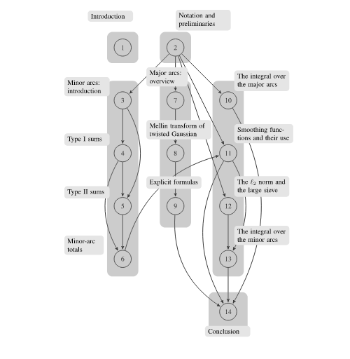
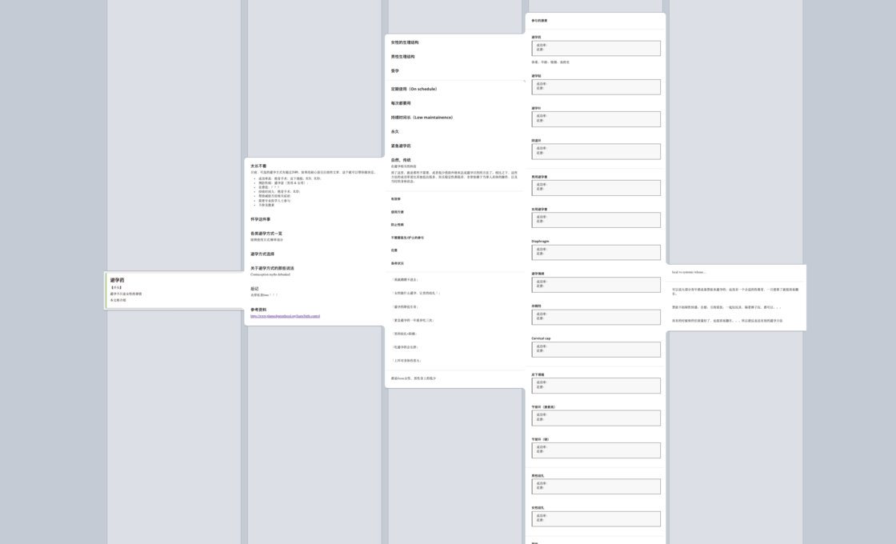

# 017 🏅 成为职场优秀程序员的 5 个建议

欢迎打开第 017 期「野生架构师」周刊，这是由  [lcomplete](https://twitter.com/lcomplete_wild) 发送的 newsletter，本期的主题是「成为职场优秀程序员的 5 个建议」，另外还有 💻 开发资源、📖 推荐阅读、🕵 探索发现和 📜 精彩言论版块。

## 📝 本期主题：成为职场优秀程序员的 5 个建议

今年大厂裁员一直是个热门话题，想必不少程序员朋友或多或少都有一些职业焦虑，那么这期就来聊一聊程序员如何在职场中脱颖而出，希望对有需要的朋友有所帮助。

1. **编写与众不同的简历。** 你的简历不应该只是一个静态的 pdf，而应该是一个能够全方位展示自己、可交互的、可联网的信息载体，编写一个简历网页会是一个不错的选择，比如：[lcomplete-2013-resume](https://codelc.com/intro_2013/)，这是我多年前制作的一个在线简历，当时将其放在自己用两个晚上开发的 [coderinfo](https://github.com/lcomplete/coderinfo) 中，在 pdf 版本的简历中我还用 star 评分直观地列举了自己掌握的技能，通过这些足以快速了解我的开发能力。这是多年前使用的一些方法，时至今日，假如需要再写简历的话，我会通过增加 emoji 来优化简历的阅读体验、制作一个视频来介绍自己等等方式来打造一个能令自己脱颖而出的简历。
2. **注重实效，做个敏捷的程序员。** 实践敏捷开发，持续集成并把握开发节奏；确保敏捷反馈，编写单元测试来倾听代码的反馈；做到敏捷编码，保持简单性，防止过度设计；优化敏捷调试，不要让错误悄悄溜走，向用户提供有用的错误信息；重视敏捷协作，`优秀的设计从积极的程序员那里开始演化`，记住大图景，不要只顾做自己的事情，千万别成为温水里的青蛙。更多内容可查看：[敏捷开发修炼之道.pptx](https://github.com/lcomplete/TechShare/blob/master/docs/thinking/%E6%95%8F%E6%8D%B7%E5%BC%80%E5%8F%91%E4%BF%AE%E7%82%BC%E4%B9%8B%E9%81%93.pptx)。
3. **制定工作检查清单，做事周全到令他人惊讶。** 程序员的工作不只有写代码一件事情，如何开始和结束一天的工作、如何检查工作完成情况、什么时候向上级汇报等等，列一个清单能够帮助我们更好地开展工作，久而久之当它成为一种肌肉记忆时，别人会惊讶于你做事的全面性。
4. **持续扩大在团队中的影响力，但一定要谦虚。** 在团队中证明自己的实力一件好事情，但千万不要表现地傲慢和自负。当同事分享了一个不错的工具，也许你有一个更好的，别急于否定它，换一种更谦虚的方式推荐给 TA，才能收获到更真诚的赞美。当你比他人强一点点的时候是很容易招致嫉妒的，而当你大幅超过 TA 时，对方很可能会崇拜你并向你学习。
5. **持续优化编码方法，在工作中始终保持进步。** 没有人不痛恨开发后台管理系统，枯燥的表单和重复的 CRUD 让人感觉自己只是在机械的劳作，那么我们能否找到重复之处，站在更高的抽象层次上将其消灭掉呢，当然是可以的，不断优化自己的工作流程，总能令自己保持进步。当你已经优化的差不多时，升职加薪也就来了。With great power comes great money 🤑。

## 💻 开发资源

> 这个版块分享与软件开发相关的内容，包括前后端实用项目和相关工具分享。

### 1、后端实用项目

1. [pika](https://github.com/OpenAtomFoundation/pika)，这是一个由 360 的 DBA 团队和基础设施团队开源的 nosql 数据库，它兼容 redis 通信协议，可以使用现有 redis 客户端进行连接。现在许多大型应用越来越依赖 redis，但 redis 也有其局限性——内存较贵，所以出现不少兼容 redis 协议并将数据存储在磁盘上的数据库，这类数据库一般使用 LSM 存储结构，以支持超高的磁盘读写速度，性能与 redis 相差不算太大，可应用在拥有海量键值对数据的场景下。本人在生产环境中使用过，服务稳定，亲测可用 🤞。
2. [Adminer](https://www.adminer.org/)，这是一个数据库管理系统，仅用一个 php 文件就可以支持 MySQL、MariaDB、PostgreSQL、SQLite、MS SQL、Oracle、Elasticsearch、MongoDB 等数据库，php 果然是世界上最好的语言 😂。不过它的源代码并非只有一个文件，而是使用了一个 [compile.php](https://github.com/vrana/adminer/blob/master/compile.php) 文件将整个项目「编译」为单个文件。

### 2、前端实用网站

1. [Landing Page Examples](https://landingpage.fyi/index.html)，该网站提供落地页灵感和示例，还有一个制作落地页的 [Checklist](https://landingpage.fyi/landing-page-checklist.html)。
2. [Checklist Design](https://www.checklist.design/)，该网站提供最佳设计的检查清单，包括网站页面、元素、流程、主题和品牌。
3. [Favicon Generator](https://favicon.io/favicon-converter/)，将图片转换为 Favicon 的小工具，可生成多种适用于网站的尺寸，使用方便。
4. [Trending Color Palettes - Coolors](https://coolors.co/palettes/trending)，这里有许多好看的配色主题，不懂设计也可以搭配出好看的网页配色。
5. [CSS Scan](https://getcssscan.com/)，通过这个网站可以快速获取 CSS 样式，比如要设置盒模型的阴影效果，到 [box-shadow examples](https://getcssscan.com/css-box-shadow-examples) 这里挑选一个即可。

### 3、小众工具

1. [generatedata.com](https://generatedata.com/)，快速生成测试数据，可支持多种数据类型、数据格式和编程语言。
2. [SlidesCodeHighlighter](https://romannurik.github.io/SlidesCodeHighlighter/)，如果你经常写 PPT 就会发现在其中放代码有多不方便，这个工具可以生成适用于 PPT 中的文本格式，当然如果要进行大量的代码分享，建议使用 markdown 格式来制作网页版 PPT。

## 📖 推荐阅读

> 这个版块主要分享一些我认为值得阅读的文章，对于引起我较多思考的则会展开来聊一聊。

1、[开发者代码审查指南 | 谷歌工程实践](https://jimmysong.io/eng-practices/docs/review/)

代码审查的微观目标是在每次 review 中尽可能获得最佳的提交，宏观目标是逐步改善代码库的整体健康状况，谷歌的这份工程实践提供了一个非常好的操作指南。

2、[《代码大全》 - PegasusWang 的读书笔记](https://pegasuswang.readthedocs.io/zh/latest/code/%E4%BB%A3%E7%A0%81%E5%A4%A7%E5%85%A8/)

培根说有些书可以请人代读，他又说阅读他人的读书笔记就像喝蒸馏过的水一样并没有什么味道，对于经典书籍的读书笔记，我们可以发挥它的作用——快速导览全书或者用来回顾，但也应当自己去读一读。

3、[A Whole Website in a Single JavaScript File](https://deno.com/blog/a-whole-website-in-a-single-js-file)

Deno 提供了部署 Javascript 代码的服务，能实现一个 JS 文件部署整个网站，而且它还支持 SSR（Server-Side Rendering），给我的感觉是前端的工程化已经越来越成熟，要开始走向化繁为简了，这对于开发者来说无疑是个好事。

前端开发领域发展迅速，涌现出一大批框架和工具，这加重了开发者的心智负担，能否从 `深不可测` 进入 `返璞归真` 呢？

**读者朋友们认为前端开发进入化繁为简的趋势了吗？**

4、[Turn the web into a database: An alternative to web crawling/scraping - Mixnode News Blog](https://www.mixnode.com/blog/posts/turn-the-web-into-a-database-an-alternative-to-web-crawling-scraping)

我在 [002🕷 Web 3.0、关于好品味的商业模式](http://weekly.codelc.com/issues/web-3-0-1032439) 这期 newsletter 中提到`将互联网转换为数据库`这个概念，于是顺着这个我想到了一个 idea ——编写 SQL 来查询互联网上的数据，搜索了一下便找到了这篇文章，还真有人做了。

我感觉这个想法如果做成开源项目，应该会很有潜力。🤔

5、[How I learned to stop worrying and structure all writing as a list](https://dynomight.net/lists/)

互联网上的文章通常有两种类型，比如：

1. 《论如何成为职场优秀程序员》
2. 《成为职场优秀程序员的 5 个建议》

显然第二种更吸引人，但作者认为这种 List 结构的文章被滥用了，低质文章以及黑帽 SEOer 制造的这类垃圾信息，让人们开始讨厌这种风格的文章。

不过作者最终还是决定使用 List 结构来写作，因为它有种种好处：可以降低文章的复杂性、快速给读者传递主要内容等等。我非常赞同这一点，所以之前才会二次开发出 [Simple Outliner / 智能网页大纲](https://chrome.google.com/webstore/detail/simple-outliner-%E6%99%BA%E8%83%BD%E7%BD%91%E9%A1%B5%E5%A4%A7%E7%BA%B2/ppdjhggfcaenclmimmdigbcglfoklgaf) 这个插件。

作者还提到了 List 结构的局限性，在复杂的书籍中，它无法很好地提升内容的可阅读性，比如我们看数学书时，都有过这样的经历，看到一个不会的 A 公式，需要去了解它是如何推导出来的，结果发现了 B 公式，又通过 B 公式发现了 C 公式，循环往复，大概就是下图这个样子。

还好有互联网，我们可以通过搜索解决一部分问题。那么我就在想，目前的电子阅读还需要创新和进化以解决这个问题，到那时，纸质书很可能将成为一种复古行为。

我理想中的电子书，有点像卡片盒，一个知识点可以链接到所有相关的知识点，并且有良好的索引和层次结构，类似下图，而且可以动态交互。

`未来的电子阅读会不会朝这个方向发展呢？`

## 🕵 探索发现

> 这个版块分享我最近发现的好东西，包括优质订阅源、资源集合、好工具等，希望这些入口也能帮助你探索发现到好的事物。

1、[冰哥笔记 | 做一个有趣、有料的博客](https://www.bgbiji.com/)

一个优质博客，看了这篇 [《我的每日私人成长暗器》](https://www.bgbiji.com/909.html) 后果断订阅了。

2、[Track your Favorite Github Awesome Repo | Track Awesome List](https://www.trackawesomelist.com/)

Github 上有许多 `Awesome List` 类的项目，Star 或者 Watch 了也很难跟踪它新增了什么，用这个网站则可以满足这个需求，在上面不仅可以找到热门项目，还可以使用 RSS 来订阅它们的变更。

3、[The Pragmatic Engineer | Gergely Orosz | Substack](https://newsletter.pragmaticengineer.com/)

Gergely Orosz 是 Substack 上付费技术类排名第一的作者，最近才开始细看他的文章，他的周刊主要是面向技术 Leader，目标是帮助工程师和工程师主管成为更好的 Leader。除了付费的内容，也有部分免费的，比如这篇 [Becoming a Better Writer - by Gergely Orosz](https://newsletter.pragmaticengineer.com/p/becoming-a-better-writer)。

4、[A list of new(ish) command line tools](https://jvns.ca/blog/2022/04/12/a-list-of-new-ish--command-line-tools/)

一份有点「新」的命令行工具列表，这里列出了可以替换标准工具的「新」工具，还有各种新发明的，文章标题中用了 new(ish) 是因为这里的工具其实并不算新了，只是许多人并不知道它们。

比如我知道 `lazygit`，但还真不知道有个 `lazydocker`。

5、[Open Source Alternatives to Proprietary Software](https://www.opensourcealternative.to/)

聚合了 300 多个能够替换主流 Saas 服务的开源替代品，比之前分享过的 [Opensource.builders](https://opensource.builders/) 还更加全面。

6、[Pika – Create screenshots and browser mockups quickly](https://pika.style/)

这个工具可以用来美化截图和制作开放图谱（Open Gragh）图片。

like this 👇

不过 Pika 这个名字确实太多产品用了，跟前面提到的 pika 数据库重名了，可能大家都喜欢皮卡丘？ 🤣

## 📜 精彩言论

本期精彩言论来自 Neo Zhang 的周刊：[4/17/2022: World of Pain](https://pt.plus/4-17-2022-world-of-pain/)（需要订阅才可查看，这篇是免费的），其中包含他对《In Elden Ring, the Struggle Feels Real》这篇文章的部分翻译，原文将老头环的游戏体验和现实世界中的疫情联系了起来。

> 当我们中的一些人为了过上正常生活而放松警惕时，我们正在为拐角处那只可能会杀死我们的愚蠢大鸟做好准备。 我们从这场大流行病中吸取的教训——期待失望和更多的挣扎——让我们为 Elden Ring 做好了准备。
>
> 制作人宫崎英高早年的一次经历被用来解释为什么会把游戏设计成这种痛苦挣扎的体验：
>
> 宫崎在接受采访时表示，他的灵感来自多年前的一次亲身经历，当时他在积雪覆盖的小山上开车。 他前面的一辆车卡住了，他和他后面的一辆车也卡住了，但后面的另一辆车向前开去，开始推第三辆车。 类似的帮助最终让每个人都翻山越岭。
>
> 卫报编辑 Keza MacDonald 说：
>
> 我们进入彼此的生活一分钟，然后消失，仍然产生影响。 这并不是真正的一个玩家与游戏的对抗。 这是整个玩家社区与游戏的对抗。

---

欢迎来信告诉我你比较喜欢哪个版块，bye。

2022-4-22

Util next week,

lcomplete
