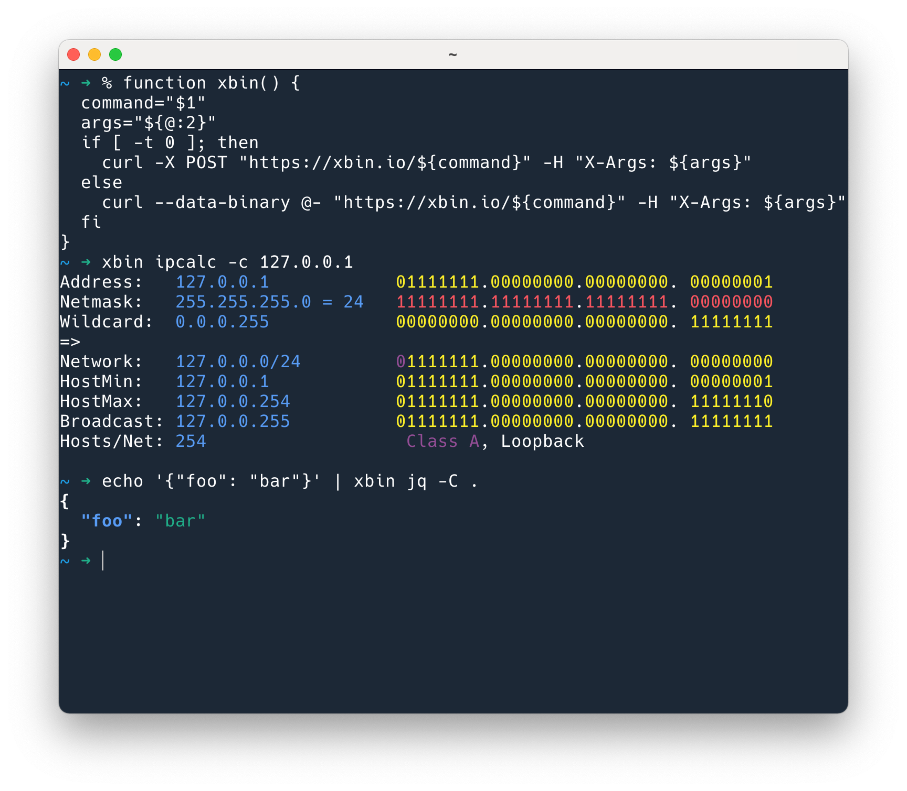
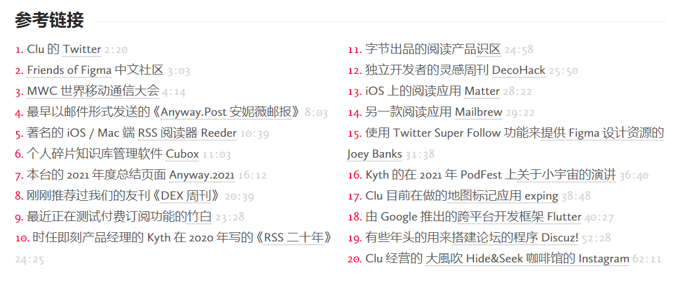

# 019 ✨ 从凯文·凯利的建议中找到对自己有用的那 10%

欢迎打开第 019 期「野生架构师」周刊，这是由  [lcomplete](https://twitter.com/lcomplete_wild) 发送的 newsletter，本期的主题是「从凯文·凯利的建议中找到对自己有用的那 10%」，另外还有 💻 开发资源、📖 推荐阅读、🕵 探索发现和 📜 精彩言论版块。

## 📝 本期主题：从凯文·凯利的建议中找出对自己有用的那 10%

多年前拜读过凯文·凯利（下文简称 KK）的著作《失控》，这绝对是一本充满智慧的书，还有《科技想要什么》，不管是书名还是其中的内容，都显露出 KK 站在与众不同的视角去思考问题的能力，而这往往能看到很多别人无法看到之处。

前些天 KK 70 岁生日之际，又写了 103 条人生建议：[103 Bits of Advice I Wish I Had Known](https://kk.org/thetechnium/103-bits-of-advice-i-wish-i-had-known/) 。

其中有这样一条：

> 90% of everything is crap. If you think you don’t like opera, romance novels, TikTok, country music, vegan food, NFTs, keep trying to see if you can find the 10% that is not crap.

来自枫言枫语的翻译（我看了几个版本的翻译，这个是我看到的最好的版本）：

> 所有东西的 90% 都是垃圾。如果你觉得自己不喜欢歌剧，浪漫小说，抖音，乡村音乐，素食，NFTs，那你可以试试看自己能否找出不是垃圾的 10%。——[凯文·凯利 70 岁生日写的 103 条人生忠告（中文翻译）](https://justinyan.me/post/4911)

这 103 条建议中，有一些可能是只对 KK 个人有用的，有一些是缺乏上下文的，还有一些是鸡汤，但就像 KK 说的这条一样，**发现事物的缺陷是一种能力，发现事物的优点更是一种能力**。我可以说 KK 这句话也有其“垃圾”之处，90% 从何而来呢，但这其实并不重要，不必纠结于数字游戏，这句话背后的思想，是值得深思的，`善于发现优点是一种难能可贵的品质`。

> 前年 4 月 28 日，68 岁的凯文·凯利在生日这天发表了[给年轻人的 68 条建议](https://kk.org/thetechnium/68-bits-of-unsolicited-advice/)，去年 69 岁生日发表了[99 条建议](https://kk.org/thetechnium/99-additional-bits-of-unsolicited-advice/)，今年是他的 70 岁生日，建议[增加到了 103 条](https://kk.org/thetechnium/103-bits-of-advice-i-wish-i-had-known/)。这 270 条建议，其实就是凯文·凯利的人生观、价值观、世界观的总结。——[No.13: 周刊的周刊 | 胡涂说](https://hutusi.com/articles/weekly-13)

胡涂说的周刊中给出了这 270 条建议的链接，我认为是值得一读的，并且每个人读的体会也不尽相同，所以尽管有很多人已经写了许多相关文章，我这期仍然聊这个主题，相信你也能够在这 270 条建议中找到一些共鸣和启示。

我最喜欢的几条建议：

- **不要一直重复犯错；试着去犯新的错**。我一直觉得许多编程思想可以运用到生活当中，这条建议相当于是 DRY 思想在生活中的运用。重复其实是一种保守和安逸的做法，重复犯相同的错误是不是说明自己没有进步？出现这种情况时，去改变吧，试着犯新的错误。`人只要奋斗就会犯错——歌德`。
- **重复别人是一个很好的开始。重复你自己则是一个令人失望的终点**。这条建议跟上面一条有相似之处，但又完全不一样。向比自己厉害的人学习，别向自己学习。
- **当你在领导时，你真正的任务是创造出更多领导者，而不是更多追随者**。在你成为领导者之前，成功与否只在于自己，而在成为领导者之后，成功与否则在于能否令他人得到成长。如何衡量他人的成长，如果他们只是追随你，并不足以说明，如果以 KK 这个建议为标准，那么当你影响到他，并且他也影响更多的人时，那么你无疑是一个出色的领导者。
- **学生的责任是从老师身上学会一切，老师的责任是从学生身上学会一切**。不一定需要是老师或者学生这样的角色，员工可以从领导那里学习，领导也应从员工身上学习。
- **自信地发言就像你是对的一样，仔细的聆听就像你是错的一样**。谦虚且仔细地进行倾听，思考周全后再自信地发言。
- **要花跟写邮件正文一样的时间来雕琢邮件标题，因为很多时候邮件标题是人们唯一会读的东西**。不要做标题党，但是当你写的东西真的很有料时也千万别忘了取个好点的标题。
- **为了丰厚的回报，请对你完全不感兴趣的事物保持好奇**。这也是避免信息茧房的有效办法。

## 💻 开发资源

1、[Xbin Playground](https://xbin.io/)

这是一个运行在云端的 cli 工具，当在管理一台服务器，而上面有很多工具没安装时，可以用这个工具来运行需要的命令，很适合运维和 SRE 工程师们使用。

2、[GitHub - 💩State-of-the-art shitcode](https://github.com/trekhleb/state-of-the-art-shitcode) `#fun`

多年前，我跟一个还在试用期的工程师说不要使用 `flag` 来命名，他很困惑，说这有什么关系，于是我让他去看看《代码整洁之道》，不知他看了没有，总之他还是很固执地认为这样没什么问题，于是我没让他过试用期 🤣。如果当时给他一份「编写狗屎代码的艺术」，可能他会比较重视这个问题。

这样的反讽带来的效果往往更好（虽然比较刻薄）——如果有两条路都能到达终点，只是有一条路上充满着狗屎，你会选哪条？

这也让我想到耗子哥写的 [《开发团队的效率》](https://coolshell.cn/articles/11656.html)，其中列举了几种软件开发方式：

- “接力棒式”软件开发
- “保姆式”软件开发
- “WatchDog 式”软件开发
- “故障驱动式”软件开发

⚡ 这些都是应该避免的。

## 📖 推荐阅读

1、[RSS 二十年 | 即刻公众号](https://mp.weixin.qq.com/s/VUhz2Tg08UqYSAZB6nU9MQ)

这是即刻的产品经理 kyth 的文章，其中包含许多对 RSS 的思考，RSS 诞生至今已经 22 年，这是 2 年前的文章。

他在这篇文章中写道：Newsletter 和 RSS 的精神内核是差不多的，RSS 烧制器这类「个人网摘」现在换了个名字叫 newsletter。当然网摘只是 newsletter 的形式之一。

> 即刻其实从第一天开始就很清楚 RSS 是什么，RSS 的局限性，以及即刻比古典 RSS 更有意思的地方在哪里。
>
> 在即刻早期我曾经发过一条微博说，其实即刻才是真正的 Really Simple Syndication，甚至是 Really Smart Syndication，因为传统 RSS 只是机械地订阅一个信息源（其假设是相信一个信息源、人或者机构，能稳定、持续地生产出符合自己预期的内容），但比信息源更原始、更本质的需求，是想订阅一个信息，对一个未来可能发生的事情感兴趣。订阅未来。

即刻的早期版本确实更酷，但也更小众，所以现在已经完全偏离最初的版本设计了。

正是带着对 RSS 的这些理解，他们做出了小宇宙播客 App，据说现在很火，祝他们成功。

2、[Slack、Figma、Obsidian、PPT……你常用的软件还有这些「不一样」的用法 - 少数派](https://sspai.com/post/68633)

用来记录想法最方便快速的工具，我想是聊天软件，在聊天软件中最合适的可能要属 Slack，Slack 这个词其实是一个缩写，意思是「所有可搜索的会话和知识日志」（Searchable Log of All Conversation and Knowledge）。

我现在用它来记录许多零散的信息，当然它最重点的是协作功能，因此我另外建了一个空间，里面只有我和我的妻子，用来发送值得归类和记录的信息也不错。

## 🔭 探索发现

1、[与主编 Clu 一起揭秘 Anyway.News 编辑部](https://anyway.fm/clu-anyway-news/)

因为 Clu 在这期节目中聊了下 newsletter，所以过来听了下，他提到许多 newsletter 中包含重复的推荐链接，就像这次大家都在分享 KK 的建议一样，这确实是个问题，但也是一个机会，可以作为 newsletter 平台或工具改进的一个方向。🤔

另外，这个网页中的参考链接还包含许多优质信息源，值得探索。

2、Newletter 单/双向推荐

- [DEX 周刊](https://newsletter.dex.group/)：关于产品、设计、前端、软件等内容的精华资讯邮件列表。
- [GeekPlux Lab](https://geekplux.zhubai.love/)：技术、金融、设计、区块链、跑步徒步，把有限的生命浪费在无限的浅尝辄止上，Always Exploring。随想随感，每周一更。
- [程序员的喵](https://catcoding.me/)：主要写技术、写作、英语、个人成长相关主题。
- [胡涂说](https://hutusi.com/)：在他的 [关于 | 胡涂说](https://hutusi.com/about/) 页面能探索到很多有趣内容。
- [好工具周刊](https://bestxtools.zhubai.love/)：发现并分享有趣，有创意，免费、好用的工具，每周四发布。
- [4Ark × Weekly](https://4ark.me/weekly/)：每周分享生活感悟、推荐文章、有趣的东西。
- [刻意体会](https://kyth.hedwig.pub/)：即刻的产品经理 kyth 的 newsletter，可以看出 Hedwig 平台对「个人网摘」的支持是很友好的。

## 📜 精彩言论

KK 已经给我们带来了太多的精彩言论，放其他的似乎都会略显逊色。

那么这期的言论并非来自人类，而是来自 AI，颤抖吧，人类。🤣

> WebRemember 是一项新技术，用于记忆长期的网页序列。它采用了自我注意和一种新的基于记忆的注意机制的组合。WebRemember 取得了比 LSTM 和 BERT 更好的性能，并在 GLUE 基准测试中取得了最先进的性能。——[WebRemember | This AI Does Not Exist](https://thisaidoesnotexist.com/model/WebRemember/JTdCJTIyZGVmbiUyMiUzQSUyMldlYlJlbWVtYmVyJTIwaXMlMjBhJTIwbmV3JTIwdGVjaG5pcXVlJTIwdG8lMjByZW1lbWJlciUyMGxvbmctdGVybSUyMHNlcXVlbmNlcyUyMG9mJTIwd2VicGFnZXMuJTIwSXQlMjBlbXBsb3lzJTIwYSUyMGNvbWJpbmF0aW9uJTIwb2YlMjBzZWxmLWF0dGVudGlvbiUyMGFuZCUyMGElMjBub3ZlbCUyMG1lbW9yeS1iYXNlZCUyMGF0dGVudGlvbiUyMG1lY2hhbmlzbS4lMjBXZWJSZW1lbWJlciUyMGFjaGlldmVzJTIwYmV0dGVyJTIwcGVyZm9ybWFuY2UlMjB0aGFuJTIwTFNUTSUyMGFuZCUyMEJFUlQlMkMlMjBhbmQlMjBhY2hpZXZlcyUyMHN0YXRlLW9mLXRoZS1hcnQlMjBwZXJmb3JtYW5jZSUyMG9uJTIwdGhlJTIwR0xVRSUyMGJlbmNobWFyay4lMjIlMkMlMjJ1c2FnZSUyMiUzQSUyMmZyb20lMjBnZW5zaW0ubW9kZWxzJTIwaW1wb3J0JTIwV2ViUmVtZW1iZXIlNUNuJTVDbm1vZGVsJTIwJTNEJTIwV2ViUmVtZW1iZXIoKSU1Q25tb2RlbC5pbml0X2Zyb21fcHJldHJhaW5lZCgnaHR0cHMlM0ElMkYlMkZzMy5hbWF6b25hd3MuY29tJTJGbW9kZWxzLmh1Z2dpbmdmYWNlLmNvJTJGYmVydCUyRmJlcnQtYmFzZS1jYXNlZC12b2NhYi50eHQnKSU1Q25tb2RlbC5pbml0X2Zyb21fcHJldHJhaW5lZCgnaHR0cHMlM0ElMkYlMkZzMy5hbWF6b25hd3MuY29tJTJGbW9kZWxzLmh1Z2dpbmdmYWNlLmNvJTJGYmVydCUyRmJlcnQtYmFzZS1jYXNlZC1maW5ldHVuZWQtc3F1YWQudHh0JyklNUNubW9kZWwuaW5pdF9mcm9tX3ByZXRyYWluZWQoJ2h0dHBzJTNBJTJGJTJGczMuYW1hem9uYXdzLmNvbSUyRm1vZGVscy5odWdnaW5nZmFjZS5jbyUyRmJlcnQlMkZiZXJ0LWJhc2UtY2FzZWQtc3F1YWQudHh0JyklNUNuJTVDbiUyMyUyMHRoZSUyMHRyYWluaW5nJTIwY29ycHVzJTIwaXMlMjBhJTIwbGlzdCUyMG9mJTIwd2VicGFnZXMlMkMlMjBvbmUlMjBwZXIlMjBsaW5lJTVDbiUyMyUyMHRoZSUyMG1vZGVsJTIwd2lsbCUyMHRha2UlMjBlYWNoJTIwd2ViJTIwcGFnZSUyMGFzJTIwYSUyMHNlbnRlbmNlJTJDJTIwYW5kJTIwb3V0cHV0JTIwYSUyMHNlcXVlbmNlJTIwb2YlMjB3b3JkcyU1Q24lMjMlMjB0aGUlMjBmaW5hbCUyMHJlc3VsdCUyMHdpbGwlMjBiZSUyMHRoZSUyMG1vc3QlMjBsaWtlbHklMjBzZXF1ZW5jZSUyMG9mJTIwd29yZHMlNUNuJTIzJTIweW91JTIwY2FuJTIwYWxzbyUyMHByb3ZpZGUlMjBhJTIwY3VzdG9tJTIwY29ycHVzJTIwdG8lMjB0aGUlMjBtb2RlbCUyMGlmJTIweW91JTIwd2FudCU1Q25jb3JwdXMlMjAlM0QlMjAlNUInaHR0cCUzQSUyRiUyRnd3dy5iaW5nLmNvbSclMkMlMjAnaHR0cCUzQSUyRiUyRnd3dy5nb29nbGUuY29tJyU1RCU1Q24lNUNuJTIzJTIwc3RhcnQlMjBpbmZlcmVuY2UlNUNubW9kZWwuaW5mZXJfZnJvbV9jb3IlMjIlN0Q=)

给定一个名字，`This AI Does Not Exist` 会使用机器学习模型生成描述和代码片段，我随便输入了一个 `WebRemember`（[🔭 重新掌控自己的信息](http://weekly.codelc.com/issues/issue-1104767) 由目前在开发的信息记录工具所想到，名称还未定），瞧，代码它都帮我写好了。

---

2022-5-6

Util next week,

lcomplete
