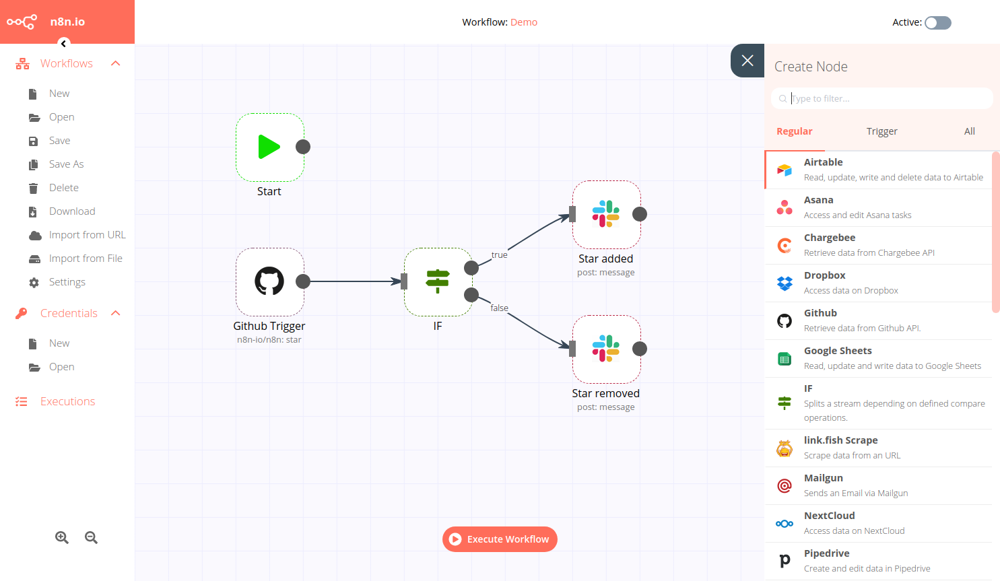
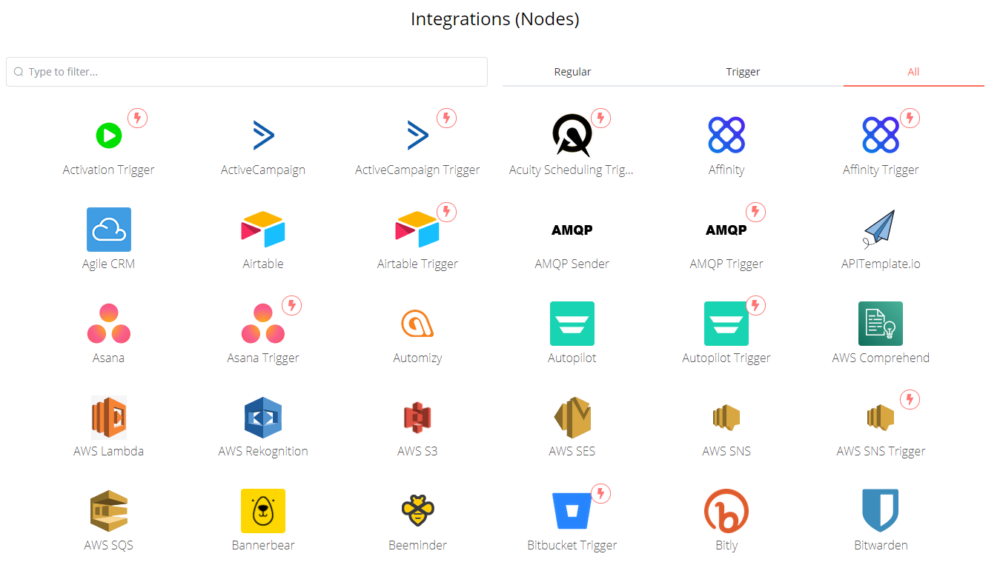

# 使用开源工作流自动化工具 n8n 打造个人助理

[n8n](https://github.com/n8n-io/n8n) 是一个开源的工作流自动化工具，类似于 IFTTT。它的优点是开源、可以自托管、下载安装方便、易于使用，可以互联的服务包括 Github、Google、RSS、Slack、Telegram、Gitlab、Redis、RabbitMq、数据库等等上百种服务。使用 n8n 可以方便地实现当 A 条件发生，触发 B 服务这样的自动工作流程。



## 安装使用

n8n 使用 TypeScript 编写，支持 npx 直接运行，安装 nodejs 运行以下命令即可运行，简直不要太简单。

```bash
npx n8n
```

## 发现可以自动化的工作流

运行 n8n 后我们可以直观到看到利用它可以连接许多服务，但是如何为我所用呢？哪些场景下可以用上它，这需要我们首先识别重复的工作流。

列举一些将重复工作流自动化的例子：

- 每天都会逛某几个网站。
  - 聚合网站信息，当有新内容时，通过聊天机器人自动通知。
- 每天上班第一件事情需要先查看是否有未处理的代码合并请求。
  - 可以让 n8n 连接 gitlab/github 检查是否有代码合并请求，有则使用聊天机器人自动通知审查团队。
- 出于工作需要，经常需要从数据库导出数据到 excel 并邮件给其他人，这个任务不足以做到系统功能中。
  - 使用 n8n 连接数据库、excel、邮件服务，将其自动化。
- redis 内存没有及时释放，需要定时扫描手动触发内存释放。
  - 使用 n8n 连接 redis，当内存达到设定值时自动执行脚本触发内存释放。
- 需要定期备份工作流配置。
  - 自动将本地 n8n 配置备份到云端。

以上简单列举一些例子，这些重复工作看似不耗时间，好像不值得花费精力将其自动化，但当我们识别出越来越多这样的工作流并将其自动化后，我们就拥有了一个强大的个人助理。

## 必备的几个常用工作流节点



n8n 拥有上百个工作流节点，许多节点你并不一定用的上，下面是一些常用的节点，我将简单介绍一下它们的作用。

### Cron

设置定时任务，Cron 触发器自然少不了。

### IF

根据输入数据设置 IF 条件决定下一步操作。

### Function

Function 节点中可以编写 JS 代码，对于复杂的 IF 条件也可以先通过 Function 来输出 bool 值以简化 IF 的判断。

以下是 Function 的示例代码，注意必须按照 items 的数据模式返回数据。

```js
var date = new Date().toISOString();
var day = new Date().getDay();
const weekday = ["Sunday", "Monday", "Tuesday", "Wednesday", "Thursday", "Friday", "Saturday"];

items[0].json.date_today = date;
items[0].json.day_today = weekday[day];

return items;
```

### Request

若没有内置的连接服务，可以自定义 HTTP 请求。

### Telegram

用 Telegram 的工作流节点发送消息非常方便，我们可以创建一个 Telegram 机器人，通过 Request 获取数据，再使用机器人将消息发送给自己或他人。

## 发现更多玩法

n8n 的工作流配置可以保存为 json 文件与他人分享，目前 n8n 的社区还在发展当中，相信未来会有许多人分享自己配置好的工作流，届时我们使用 n8n 的能力也将大幅提升。

当然现在也不妨去发现好玩的用法，探索下新奇的世界，尝试使用 n8n 连接你的 Telegram 试试吧。